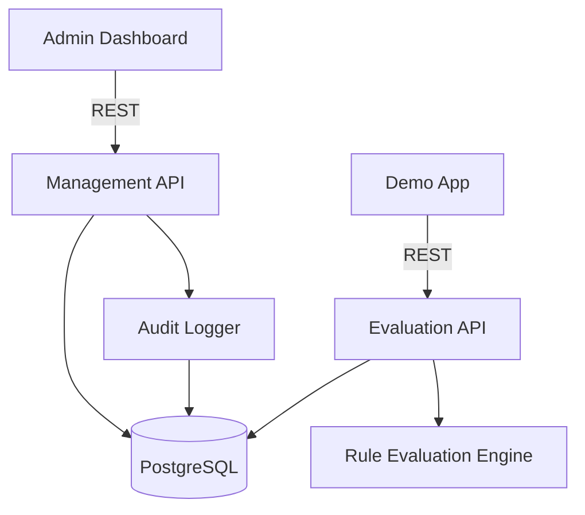
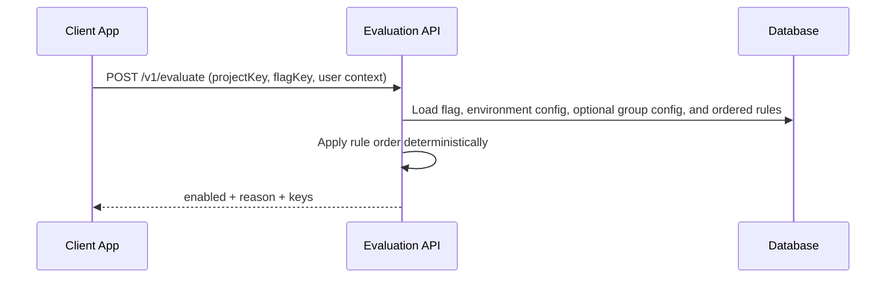
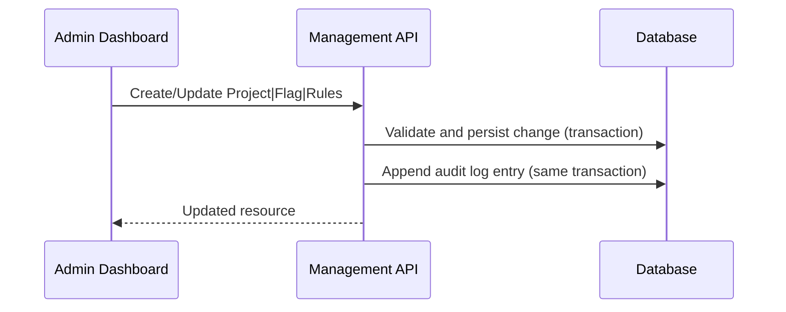
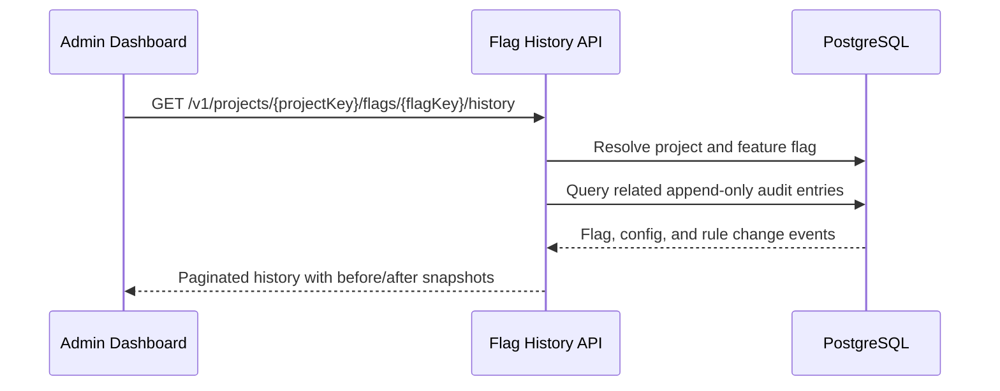
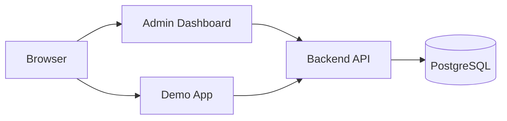

# Software Architecture Document (SAD) — Feature Flag Platform (RUP)

## Revision History
| Date | Version | Description | Author |
|---|---|---|---|
| 2026-05-30 | 1.0 | Initial SAD based on requirements and research | Principal Engineer (Copilot) |
| 2026-06-03 | 1.1 | Add active goal and mentor evaluation criteria references | Codex |
| 2026-06-24 | 1.2 | Lock Phase 12 group kill-switch domain and runtime contracts | Codex |

## 1. Introduction
### 1.1 Purpose
This document defines the software architecture for the Feature Flag Platform mini project using the Rational Unified Process (RUP) Software Architecture Document (SAD) template. It provides the architectural baseline for the MVP scope, including the control plane, data plane, demo application, and data model. It also supports the mentor evaluation criteria in `docs/requirement/info-init.md` by making the technology choices and tradeoffs explainable.

### 1.2 Scope
The system is a lightweight feature flag management platform that includes:
1. Admin dashboard for projects, flags, groups, rules, and audit logs.
2. Backend APIs for CRUD, group management, rule configuration, evaluation,
   and audit logging.
3. Demo web app that calls the evaluation API to show runtime gating.
4. Relational database for persistent storage.

### 1.3 Definitions, Acronyms, Abbreviations
| Term | Definition |
|---|---|
| Feature flag | Runtime configuration that controls feature exposure without redeploying code. |
| Control plane | Admin UI and management APIs for projects, flags, groups, and rules. |
| Data plane | Runtime evaluation path for flag decisions. |
| Kill switch | Operational control used to disable risky behavior quickly. |
| Group kill switch | Environment-specific control that forces all flags assigned to one group Off. |
| RUP | Rational Unified Process. |
| VDT | Viettel Digital Talent. |

### 1.4 References
1. `docs/plan/vision.md`
2. `docs/plan/project-plan.md`
3. `docs/requirement/requirement-init.md`
4. `docs/requirement/info-init.md`
5. `docs/plan/project-goal.md`
6. `docs/requirement/backend/be-init.md`
7. `docs/requirement/frontend/fe-init.md`
8. `docs/requirement/demo/demo-app.md`
9. `docs/requirement/demo/minimal-mvp.md`
10. `docs/requirement/use-case-specification.md`
11. `docs/requirement/feature-flag-research.md`
12. `docs/research/feature-flags.md`
13. `docs/research/rollout-strategies.md`
14. `docs/research/kill-switch-fast-rollback.md`
15. `docs/research/audit-log-configuration-changes.md`
16. `docs/research/feature-flag-key-considerations.md`
17. `docs/research/simple-api-design.md`
18. Competitor analysis: ConfigCat, LaunchDarkly, Split.io, Flagsmith, Unleash

### 1.5 Overview
The architecture emphasizes safe rollouts, deterministic evaluation, auditability, and explainability. The system balances real-world feature management principles with a minimal scope suitable for a demo-focused project.

## 2. Architectural Representation
The architecture follows the RUP 4+1 view model:
1. **Use-Case View**: key scenarios (project/flag management, rule config, evaluation, audit, kill switch).
2. **Logical View**: core components and domain model.
3. **Process View**: runtime interactions and evaluation flow.
4. **Deployment View**: physical topology and environment.
5. **Implementation View**: module/layer organization.

## 3. Architectural Goals and Constraints
### 3.1 Goals
1. **Safe rollouts** with deterministic rules and fast rollback (kill switch).
2. **Explainable evaluation** with reason codes and clear rule ordering.
3. **Auditability** for all configuration changes.
4. **Low latency** evaluation suitable for demo usage.
5. **Simplicity and clarity** aligned with educational goals.

### 3.2 Constraints
1. MVP scope only; avoid enterprise-grade complexity.
2. Single deployable platform; local demo friendly.
3. PostgreSQL required for persistence.
4. Authentication/authorization assumed or stubbed for MVP.
5. Delivery aligned to VDT schedule.
6. Architecture and technology choices must be explainable for mentor Q&A,
   including alternatives considered and comparison with existing solutions.

## 4. Use-Case View
### 4.1 Primary Use Cases
| ID | Name | Primary Actor | Summary |
|---|---|---|---|
| UC-01 | Manage Projects | Feature Owner | Create, update, list, delete projects. |
| UC-02 | Manage Feature Flags | Feature Owner | Create/edit/enable/disable flags. |
| UC-03 | Configure Flag Rules | Feature Owner | Define ordered rules for targeting and rollout. |
| UC-04 | Evaluate Feature Flag | Client Application | Get enabled/disabled result with reason. |
| UC-05 | View Audit Logs | Auditor/Compliance | Trace all configuration changes. |
| UC-06 | Emergency Kill Switch | Release Manager | Immediately disable risky features. |

### 4.2 Architecturally Significant Scenarios
1. **Rule evaluation with deterministic hashing** for percentage rollout.
2. **Terminal safety precedence** for archived, disabled, group-switch, and
   flag-switch states.
3. **Audit log write-on-mutation** for projects, flags, groups, and rules.

## 5. Logical View
### 5.1 High-Level Components


### 5.2 Component Responsibilities
1. **Admin Dashboard**: UI for project, flag, group, and rule management,
   focused per-flag configuration history, and project-wide audit log viewing.
2. **Management API**: CRUD endpoints, validation, group and rule persistence,
   and audit logging.
3. **Evaluation API**: Stateless evaluation endpoint for runtime decisions.
4. **Rule Evaluation Engine**: Deterministic evaluation with ordered rules.
5. **Audit Logger**: Append-only log of configuration changes.
6. **Database**: Persistent storage for projects, flags, groups, rules, sample
   users, and audit logs.
7. **Demo App**: Calls evaluation API to demonstrate global and targeted/rollout scenarios.

### 5.3 Logical Data Model (Summary)
Projects contain feature flags and flag groups. A feature flag may belong to
zero or one project-local group. Feature flags have environment-specific
configuration and ordered rules. Groups have environment-specific kill-switch
configuration. Audit logs record all configuration changes.

## 6. Process View
### 6.1 Evaluation Flow (Runtime)


**Evaluation precedence:**
1. Flag archived
2. Flag configuration disabled
3. Group kill switch
4. Flag kill switch
5. Global on
6. User allowlist
7. Role targeting
8. Percentage rollout (deterministic hash)
9. Default off

### 6.2 Configuration Change and Audit


### 6.3 Audit-Backed Flag Configuration History


Flag configuration history is a read-only control-plane projection over
`AuditLogEntry`. The implementation deliberately avoids a second configuration
version table, preventing duplicated history state and conflicting sources of
truth.

History association uses immutable feature-flag and configuration IDs.
Human-readable keys remain available for display but are not the primary
ownership relationship. The history endpoint does not participate in runtime
evaluation and cannot alter feature availability.

### 6.4 Group Kill-Switch Domain Model

Group membership is project-wide and stored as an optional relationship from
`FeatureFlag` to `FlagGroup`. A feature flag may belong to at most one group,
and both records must belong to the same project. Group keys are immutable
after creation. Group deletion is deferred from Phase 12 to avoid ambiguous
unassignment and historical-reference behavior.

Group runtime state is environment-specific and stored separately in
`FlagGroupConfig`. Each group has at most one configuration per environment,
and `killSwitch` defaults to `false`. Group creation initializes an inactive
configuration for every environment already owned by the project so
project-wide assignment cannot introduce missing group state in another
environment.

Evaluation resolves group state through:

```text
FlagEnvironmentConfig
-> FeatureFlag
-> optional FlagGroup
-> FlagGroupConfig for the evaluated Environment
```

The group kill switch uses this terminal-condition precedence:

1. `FLAG_ARCHIVED`
2. `FLAG_DISABLED`
3. `GROUP_KILL_SWITCH`
4. `KILL_SWITCH`
5. `GLOBAL_ON`
6. ordered enabled rules
7. `DEFAULT_OFF`

A missing expected group configuration is treated as invalid persisted state.
Evaluation fails closed with `enabled=false` and `reason=ERROR` rather than
silently bypassing the group safety control.

Group switch activation creates one append-only audit entry for the group
configuration mutation. It does not create artificial mutation entries for
every assigned feature flag. Flag assignment and unassignment are audited as
feature-flag mutations. Every mutation and its audit entry share one database
transaction.

### 6.5 Determinism and Safety
1. Percentage rollout uses stable hashing over `(flagKey, userId)` or equivalent stable key.
2. Evaluation is idempotent and safe for repeated calls.
3. Missing project/flag returns `enabled=false` with reason `NOT_FOUND`.
4. Missing expected group configuration fails closed with reason `ERROR`.

## 7. Deployment View
### 7.1 Local Demo Topology


### 7.2 Deployment Notes
1. Single backend service hosts both management and evaluation endpoints.
2. Admin dashboard and demo app can be served as static web apps.
3. Database is a single-node PostgreSQL instance for MVP.

## 8. Implementation View
### 8.1 Layered Structure (Conceptual)
1. **API Layer**: REST controllers, request validation, error mapping.
2. **Domain Layer**: Project, Flag, Rule, Audit entities and business rules.
3. **Evaluation Engine**: Rule evaluation strategies, hashing utilities.
4. **Persistence Layer**: Repositories and data access, transaction boundaries.
5. **UI Layer**: Admin dashboard and demo app views.

### 8.2 Key Design Decisions
1. Relational schema for transactional integrity and auditability.
2. Deterministic hashing for stable percentage rollout.
3. Append-only audit log with before/after snapshots.
4. Ordered rule evaluation to avoid ambiguity.
5. Audit-backed configuration history reuses immutable audit records instead
   of maintaining a second flag-version store.
6. Group identity and environment-specific runtime state use separate
   `FlagGroup` and `FlagGroupConfig` models.
7. Group membership is a project-wide optional relation on `FeatureFlag`;
   many-to-many and environment-varying membership are intentionally avoided.

### 8.3 Technology Stack (MVP)
1. **Database**: PostgreSQL
2. **Backend**: NestJS on Node.js
3. **ORM**: Prisma
4. **Migrations**: Prisma migrate
5. **API**: REST
6. **API documentation**: Swagger
7. **Cache**: In-Memory Cache (NestJS)
8. **Testing**: Jest

## 9. Data View
### 9.1 Core Tables
| Table | Purpose | Key Fields |
|---|---|---|
| projects | Project container for flags | id, key, name, description, created_at, updated_at |
| feature_flags | Flag metadata and global toggle | id, project_id, key, name, globally_enabled |
| flag_groups | Project-local identity for grouping related flags | id, project_id, key, name |
| flag_group_configs | Environment-specific group kill-switch state | id, group_id, environment_id, kill_switch |
| flag_rules | Ordered rule definitions | id, flag_id, type, priority, parameters |
| sample_user_contexts | Demo user contexts | id, project_id, user_id, roles, attributes |
| audit_log_entries | Append-only change log | id, project_id, target_type, action, before, after |

### 9.2 Relationships
1. `projects (1) -> (N) feature_flags`
2. `projects (1) -> (N) flag_groups`
3. `flag_groups (1) -> (N) feature_flags`, with optional membership on each flag
4. `flag_groups (1) -> (N) flag_group_configs`
5. `environments (1) -> (N) flag_group_configs`
6. `feature_flags (1) -> (N) flag_rules`
7. `projects (1) -> (N) audit_log_entries`

### 9.3 Future Cache Invalidation Contract

Phase 12 does not implement caching, but it freezes the invalidation
requirements needed by Phase 13:

| Mutation | Future cache invalidation |
|---|---|
| Create group | None |
| Rename group | None for evaluation |
| Assign flag | Assigned flag in every environment |
| Reassign flag | Reassigned flag in every environment |
| Unassign flag | Unassigned flag in every environment |
| Toggle group switch | Every assigned flag in the affected environment |

Cache invalidation must run only after the database transaction commits. It
must not expose uncommitted configuration or invalidate for a transaction that
later rolls back.

## 10. Size and Performance
1. Evaluation API target latency: <= 1s (demo scale).
2. Dashboard list rendering: <= 2s on typical broadband.
3. Support pagination for list endpoints to prevent large payloads.
4. In-memory cache (NestJS) for evaluation throughput; promote to Redis if needed.

## 11. Quality Attributes and Tactics
| Attribute | Tactics |
|---|---|
| Reliability | Safe defaults (off), deterministic evaluation, idempotent APIs |
| Security | TLS, auth on all endpoints, least-privilege roles, avoid exposing sensitive flags |
| Auditability | Append-only logs, before/after snapshots, immutable records, and per-flag history projections |
| Maintainability | Modular rule engine, consistent API shapes, clear reason codes |
| Observability | Structured logs, metrics for latency/error rate, audit log traceability |
| Accessibility | WCAG 2.1 AA dashboard and demo UI |

## 12. Risks and Mitigations
| Risk | Impact | Mitigation |
|---|---|---|
| Evaluation logic bugs | Incorrect gating | Unit tests for rule engine, deterministic hashing |
| Schedule slippage | Miss deadlines | MVP-first scope and clear phase gates |
| Audit gaps | Compliance risk | Transactional audit logging for all mutations |
| CORS/security issues | Demo failures | Early API integration test, fallback proxy |
| Scope creep | Delay MVP | Strict MVP gate before enhancements |

## 13. Future Considerations
1. **Caching**: Promote to Redis if in-memory cache is insufficient.
2. **Frontend build**: Build the admin dashboard and demo UI for production.
3. **Platform hardening**: Add auth, logging, realtime updates, and deployment automation.
4. **Docker**: Ensure Docker integration is part of the delivery plan.

## 14. Appendix
### 14.1 Reason Codes (Draft)
Reason codes reflect the matched rule or default. Draft set:
- `FLAG_ARCHIVED`
- `FLAG_DISABLED`
- `GROUP_KILL_SWITCH`
- `KILL_SWITCH`
- `GLOBAL_ON`
- `USER_ALLOWLIST`
- `ROLE_MATCH`
- `PERCENTAGE_ROLLOUT`
- `DEFAULT_OFF`
- `NOT_FOUND`
- `INVALID_CONTEXT`
- `ERROR`

### 14.2 Rule Types (MVP)
1. Global enable/disable
2. User allowlist
3. Role targeting
4. Percentage rollout (deterministic hashing)

### 14.3 External Interfaces (MVP)
1. `/v1/projects`
2. `/v1/projects/{projectKey}/flags`
3. `/v1/projects/{projectKey}/flags/{flagKey}/rules`
4. `/v1/evaluate`
5. `/v1/projects/{projectKey}/audit-logs`
6. `/v1/projects/{projectKey}/groups`
7. `/v1/projects/{projectKey}/groups/{groupKey}`
8. `/v1/projects/{projectKey}/groups/{groupKey}/config`
9. `/v1/projects/{projectKey}/flags/{flagKey}/group`
