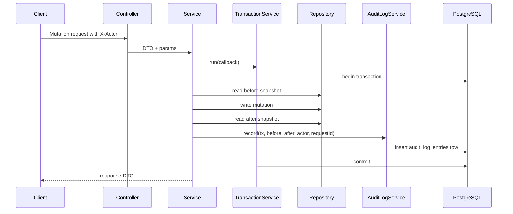

# Control-Plane API and Audit Logs — Phase 5 Learning Guide

> **Phase 16 update:** The `X-Actor` examples below document the Phase 5 MVP.
> Current control-plane APIs use server-resolved demo bearer identities, and
> client actor or role headers are not trusted.

This document explains the Phase 5 control-plane APIs and audit-log system from
scratch. It focuses on how management endpoints create and change feature flag
configuration, how those changes are validated, and how append-only audit logs
record every successful mutation.

Primary implementation folders:

```text
apps/backend/src/projects/
apps/backend/src/feature-flags/
apps/backend/src/flag-rules/
apps/backend/src/sample-users/
apps/backend/src/audit-logs/
apps/backend/src/audit/
apps/backend/src/repositories/
apps/backend/src/common/
```

## 1. What Phase 5 Added

Phase 5 implemented management APIs with transactional audit logging.

Implemented API areas:

1. Projects API.
2. Feature Flags API.
3. Flag Rules API.
4. Sample Users API.
5. Audit Logs API.

Implemented cross-cutting support:

1. `X-Actor` enforcement for mutations.
2. request ID propagation.
3. consistent error helpers.
4. pagination response shape.
5. thin repository layer.
6. transaction helper usage.
7. audit snapshot normalization.
8. append-only audit record insertion.
9. e2e tests for management flows.

Phase 5 does **not** mean the admin UI is complete. It means the backend
control-plane surface is ready for the admin UI and vertical slice work.

## 2. What “Control Plane” Means

The platform has two sides:

| Side | Purpose | Examples |
| --- | --- | --- |
| Control plane | Manage configuration | Projects, flags, rules, sample users, audit logs |
| Data plane | Answer runtime decisions | `POST /v1/evaluate` |

Control-plane APIs change or inspect configuration. Data-plane APIs evaluate
configuration for runtime clients.

Important separation:

- Control-plane mutations write audit logs.
- Data-plane evaluation is read-only and does not write audit logs.
- Admin dashboard should call control-plane APIs.
- Demo app should call the data-plane evaluation API.

## 3. Endpoint Map

All endpoints live under the global `/v1` prefix.

### 3.1 Projects API

```http
GET   /v1/projects
POST  /v1/projects
GET   /v1/projects/:projectKey
PATCH /v1/projects/:projectKey
```

Purpose:

- list projects,
- create project,
- get one project,
- update project display fields.

Mutation audit actions:

```text
PROJECT_CREATED
PROJECT_UPDATED
```

### 3.2 Feature Flags API

```http
GET   /v1/projects/:projectKey/flags
POST  /v1/projects/:projectKey/flags
GET   /v1/projects/:projectKey/flags/:flagKey
PATCH /v1/projects/:projectKey/flags/:flagKey
POST  /v1/projects/:projectKey/flags/:flagKey/archive
POST  /v1/projects/:projectKey/flags/:flagKey/restore
```

Purpose:

- list flags in a project,
- create a flag,
- get one flag,
- update flag metadata and default environment config,
- archive a flag,
- restore a flag.

Mutation audit actions:

```text
FEATURE_FLAG_CREATED
FEATURE_FLAG_UPDATED
FEATURE_FLAG_ARCHIVED
FEATURE_FLAG_RESTORED
```

### 3.3 Flag Rules API

```http
GET /v1/projects/:projectKey/flags/:flagKey/rules
PUT /v1/projects/:projectKey/flags/:flagKey/rules
```

Purpose:

- list rules for the default environment config,
- replace all rules for the default environment config.

Mutation audit action:

```text
FLAG_RULES_REPLACED
```

The MVP uses replace-all behavior instead of single-rule create/update/delete
endpoints. This keeps the rule editor simpler and makes audit snapshots easier
to understand.

### 3.4 Sample Users API

```http
GET    /v1/projects/:projectKey/sample-users
POST   /v1/projects/:projectKey/sample-users
DELETE /v1/projects/:projectKey/sample-users/:targetingKey
```

Purpose:

- list demo contexts,
- create a demo context,
- delete a demo context.

Mutation audit actions:

```text
SAMPLE_USER_CREATED
SAMPLE_USER_DELETED
```

Sample users are not authentication users. They are demo evaluation contexts.

### 3.5 Audit Logs API

```http
GET /v1/projects/:projectKey/audit-logs
```

Purpose:

- inspect append-only configuration history for a project.

Audit logs are read-only through the API. There is no update or delete audit
endpoint.

## 4. Layered Architecture

Each management feature follows the same shape:

```text
Controller
-> Service
-> Repository
-> Prisma/PostgreSQL
```

For mutations:

```text
Controller
-> ActorRequiredGuard
-> Service
-> TransactionService.run()
-> Repository mutation
-> AuditLogService.record()
-> commit transaction
```

### 4.1 Controller layer

Controller responsibilities:

- declare route path,
- bind path params, query params, body DTOs,
- attach Swagger metadata,
- attach `ActorRequiredGuard` to mutation endpoints,
- delegate to service.

Controllers should not:

- contain business logic,
- call Prisma directly,
- build audit entries directly,
- perform rule validation directly.

### 4.2 Service layer

Service responsibilities:

- enforce business rules,
- check existence,
- build filters and sorting,
- normalize inputs,
- enforce rule parameter constraints,
- run transactional mutations,
- create audit snapshots,
- call `AuditLogService.record()`.

### 4.3 Repository layer

Repository responsibilities:

- thin Prisma data access,
- accept optional transaction client,
- expose focused methods such as `findByKey`, `create`, `updateByKey`,
  `findMany`, and `count`.

Repositories should not:

- decide API response shapes,
- enforce `X-Actor`,
- construct audit log entries,
- know HTTP status codes.

### 4.4 Audit service layer

`AuditLogService` has one job:

> Insert audit entries inside the transaction provided by the mutation service.

It receives already-decided audit input and writes to `audit_log_entries`.

## 5. Actor and Request ID Model

### 5.1 `X-Actor`

Mutation endpoints require:

```http
X-Actor: admin@example.local
```

The actor means:

> Who caused this configuration change?

Implemented by:

```text
apps/backend/src/common/guards/actor-required.guard.ts
apps/backend/src/common/request-context/request-context.service.ts
```

Read endpoints do not require `X-Actor`.

Mutation endpoints use:

```ts
@UseGuards(ActorRequiredGuard)
@ApiSecurity('actor')
```

If `X-Actor` is missing, the response is:

```http
400 VALIDATION_ERROR
```

### 5.2 `X-Request-Id`

Clients may send:

```http
X-Request-Id: req_123
```

If omitted, the backend generates one.

The request ID is used for:

- response header,
- error responses,
- audit entries,
- server logs.

This allows a presenter or developer to connect an API call to an audit entry.

## 6. Transactional Audit Logging

The most important Phase 5 rule:

> Configuration mutation and audit log insert must happen in the same database
> transaction.

Generic mutation flow:



If the mutation fails, the audit insert rolls back.

If the audit insert fails, the mutation rolls back.

This prevents:

```text
configuration changed but no audit trail exists
```

## 7. Audit Entry Shape

Audit entries store:

| Field | Meaning |
| --- | --- |
| `projectId` | Internal project ID. |
| `projectKey` | Readable project key. |
| `environmentId` | Optional environment ID. |
| `environmentKey` | Optional readable environment key. |
| `targetType` | What kind of thing changed. |
| `targetId` | Internal ID of changed thing. |
| `targetKey` | Readable key of changed thing. |
| `action` | What happened. |
| `actor` | Who did it. |
| `before` | JSON snapshot before change. |
| `after` | JSON snapshot after change. |
| `metadata` | Extra context such as source. |
| `requestId` | Correlation ID. |
| `createdAt` | Server timestamp. |

Example:

```json
{
  "projectKey": "demo-project",
  "environmentKey": "production",
  "targetType": "FEATURE_FLAG",
  "targetKey": "new-checkout",
  "action": "FEATURE_FLAG_UPDATED",
  "actor": "admin@example.local",
  "before": {
    "status": "DISABLED"
  },
  "after": {
    "status": "ENABLED"
  },
  "metadata": {
    "source": "api"
  },
  "requestId": "req_123"
}
```

## 8. Append-Only Audit Logs

Audit logs are append-only in two ways:

1. API design exposes only `GET /audit-logs`.
2. PostgreSQL migration added triggers that reject update/delete operations.

Database triggers:

```text
audit_log_entries_no_update
audit_log_entries_no_delete
```

Meaning:

```text
INSERT allowed
UPDATE rejected
DELETE rejected
```

This is why e2e tests do not clean up audit rows by deleting them. Tests use
unique project keys instead.

## 9. Pagination and List Responses

List endpoints use:

```http
?limit=20&offset=0&sort=createdAt&order=desc
```

Shared DTO:

```text
apps/backend/src/common/dto/pagination-query.dto.ts
```

Rules:

| Field | Default | Constraint |
| --- | ---: | --- |
| `limit` | 20 | 1 to 100 |
| `offset` | 0 | 0 or greater |
| `order` | desc | `asc` or `desc` |
| `sort` | endpoint-specific | checked in service |

List response shape:

```json
{
  "items": [],
  "page": {
    "limit": 20,
    "offset": 0,
    "total": 42,
    "hasNext": true
  }
}
```

`hasNext` is calculated as:

```text
offset + limit < total
```

Important implementation detail:

> Query strings arrive as strings. `@Type(() => Number)` converts `limit` and
> `offset` before integer validation.

## 10. Error Model

Control-plane APIs use management-style errors.

Error codes:

```text
VALIDATION_ERROR
NOT_FOUND
CONFLICT
INTERNAL_ERROR
```

Example validation error:

```json
{
  "code": "VALIDATION_ERROR",
  "message": "X-Actor header is required for mutation requests.",
  "details": [
    {
      "field": "X-Actor",
      "message": "Provide X-Actor header so configuration changes can be audited."
    }
  ],
  "requestId": "req_123"
}
```

Examples:

| Case | HTTP status | Code |
| --- | ---: | --- |
| Invalid key format | 400 | `VALIDATION_ERROR` |
| Missing `X-Actor` on mutation | 400 | `VALIDATION_ERROR` |
| Missing project on control-plane API | 404 | `NOT_FOUND` |
| Duplicate project key | 409 | `CONFLICT` |
| Unexpected server error | 500 | `INTERNAL_ERROR` |

Contrast with data-plane evaluation:

> `POST /v1/evaluate` returns evaluation-shaped `200 OK` for missing
> project/flag. Control-plane APIs return normal `404 NOT_FOUND`.

## 11. Projects API Deep Dive

### 11.1 List projects

```http
GET /v1/projects?search=demo&limit=20&offset=0
```

Supports:

- search by key/name,
- pagination,
- sorting by allowed fields.

Default sort:

```text
createdAt desc
```

### 11.2 Create project

```http
POST /v1/projects
X-Actor: admin@example.local
```

Body:

```json
{
  "key": "demo-project",
  "name": "Demo Project",
  "description": "Project used for demos."
}
```

What happens:

1. Validate key/name/description.
2. Require `X-Actor`.
3. Check duplicate project key.
4. Start transaction.
5. Create project.
6. Create default `production` environment.
7. Insert `PROJECT_CREATED` audit entry.
8. Commit.

Important:

> Project creation creates the default production environment in the same
> transaction.

### 11.3 Update project

```http
PATCH /v1/projects/:projectKey
X-Actor: admin@example.local
```

Can update:

- `name`,
- `description`.

Writes:

```text
PROJECT_UPDATED
```

## 12. Feature Flags API Deep Dive

### 12.1 List flags

```http
GET /v1/projects/:projectKey/flags
```

Supports filters:

- `search`,
- `status`,
- `lifecycleStatus`.

Response includes default environment config fields:

- `status`,
- `servingMode`,
- `killSwitch`,
- `environmentKey`.

### 12.2 Create flag

```http
POST /v1/projects/:projectKey/flags
X-Actor: admin@example.local
```

Body:

```json
{
  "key": "new-checkout",
  "name": "New Checkout",
  "description": "Controls rollout of checkout."
}
```

What happens:

1. Validate key/name/description.
2. Require actor.
3. Check project exists.
4. Check flag key is unique inside project.
5. Start transaction.
6. Load default environment.
7. Create `FeatureFlag`.
8. Create default `FlagEnvironmentConfig`.
9. Insert `FEATURE_FLAG_CREATED` audit entry.
10. Commit.

Safe default config:

```text
status=DISABLED
servingMode=TARGETED
killSwitch=false
```

This means a new flag does not accidentally turn on for users.

### 12.3 Update flag

```http
PATCH /v1/projects/:projectKey/flags/:flagKey
X-Actor: admin@example.local
```

Can update:

- `name`,
- `description`,
- default environment `status`,
- default environment `servingMode`,
- default environment `killSwitch`.

Writes:

```text
FEATURE_FLAG_UPDATED
```

Important semantic distinction:

| Field | Meaning |
| --- | --- |
| `lifecycleStatus` | Flag lifecycle: `ACTIVE` or `ARCHIVED`. |
| `status` | Default environment config: `ENABLED` or `DISABLED`. |
| `enabled` | Runtime result returned by evaluation. |

### 12.4 Archive and restore

```http
POST /v1/projects/:projectKey/flags/:flagKey/archive
POST /v1/projects/:projectKey/flags/:flagKey/restore
```

Both require `X-Actor`.

Actions:

```text
FEATURE_FLAG_ARCHIVED
FEATURE_FLAG_RESTORED
```

These endpoints return `200 OK` because they mutate an existing resource rather
than creating a new one.

## 13. Flag Rules API Deep Dive

### 13.1 List rules

```http
GET /v1/projects/:projectKey/flags/:flagKey/rules
```

Supports:

- pagination,
- filter by `type`,
- sorting by allowed fields.

Rules belong to the default environment config in the current MVP API.

### 13.2 Replace rules

```http
PUT /v1/projects/:projectKey/flags/:flagKey/rules
X-Actor: admin@example.local
```

Body:

```json
{
  "rules": [
    {
      "type": "ROLE_TARGETING",
      "priority": 10,
      "enabled": true,
      "parameters": {
        "roles": ["beta-tester"]
      }
    },
    {
      "type": "PERCENTAGE_ROLLOUT",
      "priority": 20,
      "enabled": true,
      "parameters": {
        "percentage": 25
      }
    }
  ]
}
```

What happens:

1. Validate DTO shape.
2. Validate rule business parameters.
3. Require actor.
4. Start transaction.
5. Load project, flag, and default config.
6. Read existing rules as `before`.
7. Delete existing rules for that config.
8. Create replacement rules.
9. Read new rules as `after`.
10. Insert `FLAG_RULES_REPLACED` audit entry.
11. Commit.

### 13.3 Rule validation

Rules enforce:

| Rule type | Required parameters |
| --- | --- |
| `USER_ALLOWLIST` | non-empty `userIds: string[]` |
| `ROLE_TARGETING` | non-empty `roles: string[]` |
| `PERCENTAGE_ROLLOUT` | valid `percentage` number from 0 to 100 with max 2 decimals |

Also:

```text
priority values must be unique within the replacement payload
```

Why:

- duplicate priorities make ordering ambiguous,
- invalid parameters would make evaluation confusing,
- percentage rules must use the same validation as deterministic rollout.

## 14. Sample Users API Deep Dive

Sample users are demo contexts used by the admin/demo workflows.

They are not:

- login users,
- authentication accounts,
- authorization subjects,
- production customer records.

### 14.1 List sample users

```http
GET /v1/projects/:projectKey/sample-users
```

Supports:

- search by display name, targeting key, or user ID,
- role filter,
- pagination,
- sorting.

### 14.2 Create sample user

```http
POST /v1/projects/:projectKey/sample-users
X-Actor: admin@example.local
```

Body:

```json
{
  "displayName": "Beta User",
  "targetingKey": "demo-user-beta",
  "userId": "demo-user-beta",
  "roles": ["beta-tester"],
  "attributes": {
    "plan": "pro"
  }
}
```

The service normalizes:

- trims `displayName`,
- trims `targetingKey`,
- trims `userId`,
- trims roles,
- removes empty roles,
- deduplicates roles.

Writes:

```text
SAMPLE_USER_CREATED
```

### 14.3 Delete sample user

```http
DELETE /v1/projects/:projectKey/sample-users/:targetingKey
X-Actor: admin@example.local
```

Writes:

```text
SAMPLE_USER_DELETED
```

The service trims the path `targetingKey` before lookup.

### 14.4 Non-PII rule

Targeting keys should be stable and non-PII.

Good:

```text
demo-user-beta
account-123
tenant-vn-01
```

Avoid:

```text
email address
phone number
real name
national ID
```

## 15. Audit Logs API Deep Dive

### 15.1 Query audit logs

```http
GET /v1/projects/:projectKey/audit-logs
```

Supported filters:

```text
targetType
targetKey
actor
action
from
to
limit
offset
sort
order
```

Example:

```http
GET /v1/projects/demo-project/audit-logs?targetType=FEATURE_FLAG&targetKey=new-checkout&actor=admin@example.local&limit=10&offset=0
```

### 15.2 Time range filters

`from` and `to` must be ISO 8601 timestamps.

Example:

```http
GET /v1/projects/demo-project/audit-logs?from=2026-06-01T00:00:00.000Z&to=2026-06-10T23:59:59.999Z
```

The service rejects:

```text
from > to
```

with `VALIDATION_ERROR`.

### 15.3 Audit response

Each audit item includes:

```json
{
  "id": "audit_id",
  "projectKey": "demo-project",
  "environmentKey": "production",
  "targetType": "FEATURE_FLAG",
  "targetId": "flag_id",
  "targetKey": "new-checkout",
  "action": "FEATURE_FLAG_UPDATED",
  "actor": "admin@example.local",
  "before": {},
  "after": {},
  "metadata": {
    "source": "api"
  },
  "requestId": "req_123",
  "createdAt": "2026-06-11T00:00:00.000Z"
}
```

## 16. Snapshot Design

Snapshots are built through:

```text
apps/backend/src/common/utils/audit-snapshot.util.ts
```

The helper:

- removes `undefined`,
- preserves `null`,
- converts `Date` to ISO strings,
- recursively normalizes arrays and objects,
- returns Prisma-compatible JSON.

Why:

- Prisma JSON fields require JSON-safe values,
- audit entries should be readable,
- snapshots should not include unrelated fields,
- snapshots should not include secrets.

Snapshot examples:

| Mutation | `before` | `after` |
| --- | --- | --- |
| Create project | `null` | created project summary |
| Update flag | previous flag/config summary | updated flag/config summary |
| Replace rules | previous ordered rules | new ordered rules |
| Delete sample user | deleted sample user summary | `null` |

## 17. Current Implementation Caveats

These are useful to know while learning the code:

1. Some Swagger `@ApiOkResponse(... isArray: true)` annotations on list
   endpoints may not fully match the paginated `{ items, page }` response.
   Sample Users has a more explicit paginated schema.
2. The Rules list endpoint inherits default `order=desc` from
   `PaginationQueryDto`, even though rule lists are usually expected
   `priority asc`. The service intends `priority` sorting, but query defaults
   should be reviewed before UI integration.
3. Empty PATCH bodies may still be worth hardening to avoid no-op audit logs in
   future polish.
4. The API currently focuses on the default environment config for flag updates
   and rules. Environment expansion should be documented before adding richer
   environment-specific UI.

These caveats do not change the main learning model, but they are important for
Phase 6+ readiness.

## 18. Manual Smoke Tests

Before testing:

```bash
docker start ffp-postgres
npm run prisma:migrate --workspace=@ffp/backend
npm run db:seed --workspace=@ffp/backend
npm run dev:backend
```

### 18.1 Create project

```bash
curl -i -X POST http://localhost:3000/v1/projects \
  -H "Content-Type: application/json" \
  -H "X-Actor: admin@example.local" \
  -H "X-Request-Id: req_learning_project_create" \
  -d '{
    "key": "learning-project",
    "name": "Learning Project"
  }'
```

Expected:

```text
201 Created
default production environment created
PROJECT_CREATED audit entry created
```

### 18.2 Create flag

```bash
curl -i -X POST http://localhost:3000/v1/projects/learning-project/flags \
  -H "Content-Type: application/json" \
  -H "X-Actor: admin@example.local" \
  -d '{
    "key": "new-checkout",
    "name": "New Checkout"
  }'
```

Expected:

```text
201 Created
status=DISABLED
servingMode=TARGETED
killSwitch=false
FEATURE_FLAG_CREATED audit entry created
```

### 18.3 Enable flag config

```bash
curl -i -X PATCH http://localhost:3000/v1/projects/learning-project/flags/new-checkout \
  -H "Content-Type: application/json" \
  -H "X-Actor: admin@example.local" \
  -d '{
    "status": "ENABLED",
    "servingMode": "TARGETED",
    "killSwitch": false
  }'
```

Expected:

```text
200 OK
FEATURE_FLAG_UPDATED audit entry created
```

### 18.4 Replace rules

```bash
curl -i -X PUT http://localhost:3000/v1/projects/learning-project/flags/new-checkout/rules \
  -H "Content-Type: application/json" \
  -H "X-Actor: admin@example.local" \
  -d '{
    "rules": [
      {
        "type": "ROLE_TARGETING",
        "priority": 10,
        "enabled": true,
        "parameters": {
          "roles": ["beta-tester"]
        }
      }
    ]
  }'
```

Expected:

```text
200 OK
FLAG_RULES_REPLACED audit entry created
```

### 18.5 Query audit logs

```bash
curl -i "http://localhost:3000/v1/projects/learning-project/audit-logs?limit=10&offset=0" \
  -H "Content-Type: application/json"
```

Expected:

```text
200 OK
items contains project, flag, and rule audit entries
page contains limit, offset, total, hasNext
```

## 19. E2E Test Map

Primary Phase 5 e2e file:

```text
apps/backend/test/phase-5-management.e2e-spec.ts
```

Covered behavior:

- project creation creates default environment and audit log,
- missing `X-Actor` is rejected,
- duplicate project key returns conflict,
- feature flag create/update/archive/restore writes audits,
- rules replacement changes evaluation result,
- duplicate rule priorities are rejected,
- sample users are normalized and audited,
- audit logs can be queried with filters and pagination.

Run:

```bash
npm run test:e2e --workspace=@ffp/backend -- --runInBand
```

Sandbox caveat:

> Supertest e2e may require local server binding that can fail in restricted
> sandboxes. Run outside the sandbox if needed.

## 20. How to Read the Code Step by Step

### Step 1 — Shared foundations

Read:

```text
apps/backend/src/common/guards/actor-required.guard.ts
apps/backend/src/common/dto/pagination-query.dto.ts
apps/backend/src/common/errors/api-exception.helpers.ts
apps/backend/src/common/utils/audit-snapshot.util.ts
apps/backend/src/database/transaction.service.ts
```

Goal:

> Understand actor enforcement, pagination, errors, snapshots, and
> transactions.

### Step 2 — Audit insert path

Read:

```text
apps/backend/src/audit/audit-log.service.ts
apps/backend/src/audit/audit-log.types.ts
```

Goal:

> Understand how a service writes audit entries inside a transaction.

### Step 3 — Repositories

Read:

```text
apps/backend/src/repositories/
```

Goal:

> Understand thin Prisma access and optional transaction clients.

### Step 4 — Projects API

Read:

```text
apps/backend/src/projects/
```

Goal:

> Understand the simplest full control-plane mutation: create project +
> default environment + audit.

### Step 5 — Feature Flags API

Read:

```text
apps/backend/src/feature-flags/
```

Goal:

> Understand flag identity, default config, lifecycle, and status semantics.

### Step 6 — Rules API

Read:

```text
apps/backend/src/flag-rules/
```

Goal:

> Understand replace-all rule configuration and `FLAG_RULES_REPLACED` audit.

### Step 7 — Sample Users API

Read:

```text
apps/backend/src/sample-users/
```

Goal:

> Understand demo contexts, normalization, non-PII guidance, and sample-user
> audit actions.

### Step 8 — Audit Logs API

Read:

```text
apps/backend/src/audit-logs/
```

Goal:

> Understand read-only audit listing, filtering, time ranges, and pagination.

## 21. What to Unlearn

| Wrong assumption | Correct understanding |
| --- | --- |
| CRUD is enough | Configuration mutations must also write audit logs. |
| Audit logs can be edited for cleanup | Audit logs are append-only and protected by DB triggers. |
| Evaluation should audit every request | Evaluation is read-only data-plane behavior. |
| New flags should start enabled | New flags start disabled and targeted by default. |
| `ENABLED` equals runtime On | `ENABLED` is config status; runtime `enabled` comes from evaluation. |
| Sample users are real users | They are demo contexts, not authentication users. |
| Tests should delete all data | Append-only audit logs require unique test data instead. |
| Rule replacement is unsafe by default | It is acceptable for MVP when audited with before/after snapshots. |

## 22. Phase 5 Readiness Checklist

Use this checklist to verify Phase 5:

```text
[ ] Projects API exposes list/create/get/update.
[ ] Project creation creates default production environment.
[ ] Feature Flags API exposes list/create/get/update/archive/restore.
[ ] New flags default to DISABLED/TARGETED/killSwitch=false.
[ ] Rules API exposes list and replace-all.
[ ] Rule replacement validates type-specific parameters.
[ ] Rule replacement writes FLAG_RULES_REPLACED audit entry.
[ ] Sample Users API exposes list/create/delete.
[ ] Sample users normalize whitespace and roles.
[ ] Audit Logs API exposes project-scoped list with filters.
[ ] List endpoints return { items, page }.
[ ] Mutation endpoints require X-Actor.
[ ] Mutations write audit logs in the same transaction.
[ ] Audit entries contain actor, requestId, before, after, target, action.
[ ] Audit logs cannot be updated or deleted.
[ ] E2E tests cover management flow and audit writes.
```

Useful validation commands:

```bash
npm run test --workspace=@ffp/backend -- --runInBand
npm run build --workspace=@ffp/backend
npm run test:e2e --workspace=@ffp/backend -- --runInBand
npm run diff:check
```

## 23. One-Sentence Summary

Phase 5 turns the backend into a real control-plane API: administrators can
manage projects, flags, rules, and sample contexts through `/v1` endpoints,
while every successful configuration mutation is captured as an append-only,
same-transaction audit entry that can be queried through the audit logs API.
