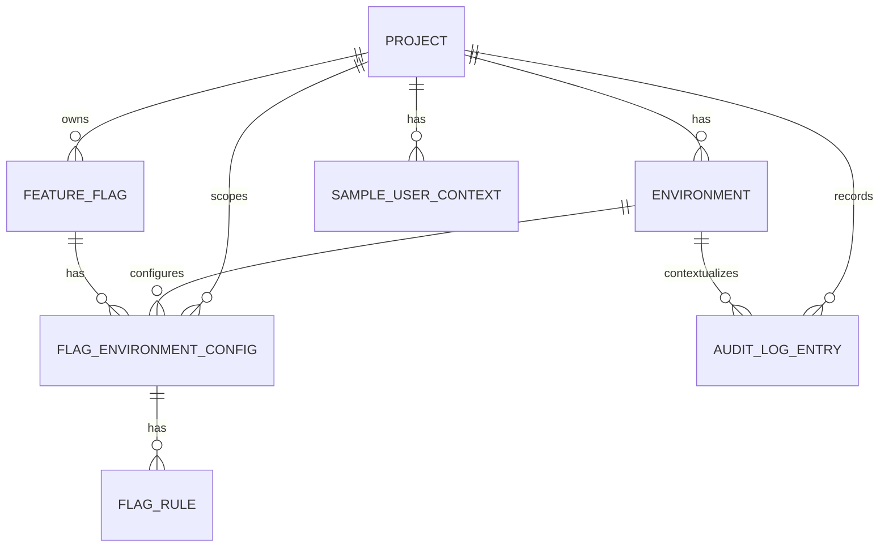
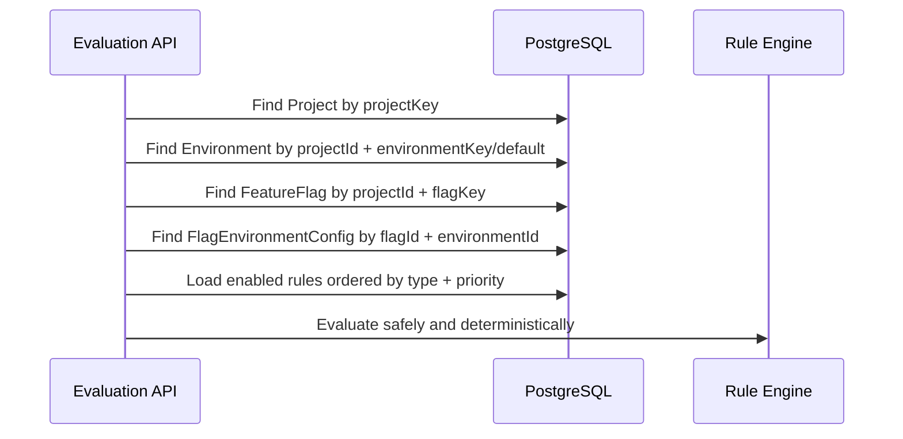

# Data Model and Migrations — Phase 2 Learning Guide

This document explains the Phase 2 data model and migration implementation from
scratch. It is a learning guide, not just a schema reference. Read it when you
want to understand how PostgreSQL, Prisma, migrations, seed data, constraints,
and future backend APIs fit together in this feature flag platform.

## 1. What Phase 2 Added

Phase 2 implemented the database foundation for the MVP.

The main files are:

```text
apps/backend/prisma/schema.prisma
apps/backend/prisma.config.ts
apps/backend/prisma/migrations/20260605133630_init_data_model/migration.sql
apps/backend/prisma/migrations/migration_lock.toml
apps/backend/prisma/seed.ts
apps/backend/package.json
```

The main database concepts are:

1. `Project`
2. `Environment`
3. `FeatureFlag`
4. `FlagEnvironmentConfig`
5. `FlagRule`
6. `SampleUserContext`
7. `AuditLogEntry`

The implementation is intentionally environment-aware. That means a feature
flag has one identity, but its runtime configuration can differ between
`production`, `staging`, and `development`.

## 2. Why This Data Model Matters

The database model must support the full MVP loop:

```text
Admin configures a flag
-> backend validates and persists the configuration
-> backend writes an append-only audit entry
-> demo app calls evaluation API
-> backend loads project, environment, flag, config, and rules
-> rule engine returns a deterministic On/Off result
```

The model must preserve these guardrails:

- deterministic evaluation,
- safe default-off behavior,
- stable non-PII targeting keys,
- append-only audit logging,
- same-transaction audit writes for future mutations,
- clear control-plane/data-plane separation,
- status labels separated from runtime evaluation output.

## 3. Beginner Mental Model

If you are new to databases, think of each table as a spreadsheet with rules.

| Database concept | Meaning in this project |
| --- | --- |
| Table | A stored collection, such as `projects` or `feature_flags`. |
| Row | One saved object, such as one project. |
| Column | One field, such as `project.key`. |
| Primary key | Stable internal ID for one row. |
| Foreign key | Link from one row to another table's row. |
| Unique index | Rule that prevents duplicates. |
| Migration | Versioned SQL change that creates or changes database structure. |
| Seed data | Repeatable sample data for local demos and tests. |
| Constraint | Database-enforced safety rule. |
| JSONB | PostgreSQL JSON storage used for flexible structured data. |

Prisma gives a TypeScript-friendly schema and client, while PostgreSQL is the
real database enforcing tables, indexes, foreign keys, and manual constraints.

## 4. Current Prisma and PostgreSQL Setup

### 4.1 Prisma schema

The schema lives here:

```text
apps/backend/prisma/schema.prisma
```

It declares:

- enums,
- models,
- fields,
- relations,
- indexes,
- unique constraints,
- table names.

### 4.2 Prisma config

The Prisma config lives here:

```text
apps/backend/prisma.config.ts
```

This project uses Prisma 7-style config:

- `schema.prisma` declares `provider = "postgresql"`,
- `DATABASE_URL` is loaded in `prisma.config.ts`,
- migrations path is `prisma/migrations`,
- seed command is `tsx prisma/seed.ts`.

Important consequence:

> Do not move `DATABASE_URL` back into `schema.prisma` unless the Prisma version
> and project config are intentionally changed.

### 4.3 Backend Prisma scripts

Backend workspace scripts:

```bash
npm run prisma:validate --workspace=@ffp/backend
npm run prisma:generate --workspace=@ffp/backend
npm run prisma:migrate --workspace=@ffp/backend
npm run prisma:studio --workspace=@ffp/backend
npm run db:seed --workspace=@ffp/backend
```

What they mean:

| Command | Purpose |
| --- | --- |
| `prisma:validate` | Check that `schema.prisma` is valid. |
| `prisma:generate` | Generate Prisma Client types and query client. |
| `prisma:migrate` | Apply or create local development migrations. |
| `prisma:studio` | Open a UI for inspecting/editing local data. |
| `db:seed` | Run idempotent demo seed data. |

## 5. High-Level Entity Relationship Diagram



The key idea:

```text
Project
-> Environment
-> FeatureFlag
-> FlagEnvironmentConfig
-> FlagRule
```

Evaluation will later need to load the flag identity plus the config and rules
for the chosen environment.

## 6. Core Design Decision: Flag Identity vs Runtime Config

The schema splits feature flags into two layers.

### 6.1 `FeatureFlag`

`FeatureFlag` stores flag identity and lifecycle:

```text
projectId
key
name
description
lifecycleStatus: ACTIVE | ARCHIVED
archivedAt
```

This answers:

> What is this flag?

Example:

```text
new-checkout
```

### 6.2 `FlagEnvironmentConfig`

`FlagEnvironmentConfig` stores runtime configuration for one flag in one
environment:

```text
projectId
flagId
environmentId
status: ENABLED | DISABLED
servingMode: GLOBAL_ON | TARGETED
killSwitch: boolean
```

This answers:

> How should this flag behave in this environment?

Example:

```text
new-checkout in production => TARGETED
new-checkout in staging    => GLOBAL_ON
```

### 6.3 Why this split is important

Without this split, changing a flag for staging could accidentally affect
production. Environment-aware config prevents that.

It also keeps concepts clean:

| Concept | Stored in | Meaning |
| --- | --- | --- |
| Flag key/name | `FeatureFlag` | Stable identity. |
| Archived lifecycle | `FeatureFlag` | Management lifecycle. |
| Enabled/disabled config | `FlagEnvironmentConfig` | Environment runtime config. |
| Kill switch | `FlagEnvironmentConfig` | Emergency Off for one environment. |
| Evaluation `enabled` | API response later | Runtime result for one request. |

Do not confuse `FlagConfigStatus.ENABLED` with evaluation response
`enabled=true`. A flag can be configured as `ENABLED` but still evaluate Off
for a user if no targeting rule matches.

## 7. Enum Map

Enums restrict fields to known values.

### 7.1 Feature flag lifecycle

```text
FeatureFlagLifecycleStatus
- ACTIVE
- ARCHIVED
```

`ARCHIVED` means the flag is no longer served normally. Future evaluation
should return `FLAG_ARCHIVED` and `enabled=false`.

### 7.2 Flag config status

```text
FlagConfigStatus
- ENABLED
- DISABLED
```

This is environment-specific. A flag can be enabled in staging but disabled in
production.

### 7.3 Serving mode

```text
ServingMode
- GLOBAL_ON
- TARGETED
```

`GLOBAL_ON` means everyone receives the feature in that environment, unless a
higher-priority Off condition such as archive, kill switch, or disabled config
wins.

`TARGETED` means rules decide who receives the feature.

### 7.4 Rule types

```text
RuleType
- USER_ALLOWLIST
- ROLE_TARGETING
- PERCENTAGE_ROLLOUT
```

These preserve the MVP rule model.

### 7.5 Audit target types and actions

Audit target types include:

```text
PROJECT
ENVIRONMENT
FEATURE_FLAG
FLAG_CONFIG
FLAG_RULE
SAMPLE_USER
```

Audit actions include create/update/delete-style actions plus:

```text
FEATURE_FLAG_ARCHIVED
FEATURE_FLAG_RESTORED
FLAG_RULES_REPLACED
```

Because rules are environment-specific, `FLAG_RULES_REPLACED` should usually
target the `FLAG_CONFIG` whose ordered rules changed.

## 8. Table-by-Table Explanation

### 8.1 `projects`

Prisma model:

```text
Project
```

Purpose:

> A project is the top-level container for environments, flags, sample users,
> and audit logs.

Important fields:

| Field | Purpose |
| --- | --- |
| `id` | Internal CUID primary key. |
| `key` | Stable human-readable project key. |
| `name` | Display name. |
| `description` | Optional explanation. |
| `createdAt` | Creation timestamp. |
| `updatedAt` | Last update timestamp. |

Important constraints:

```text
Project.key is globally unique.
```

Why:

- APIs will use `projectKey`,
- demo app defaults to `demo-project`,
- evaluation must locate a project deterministically.

### 8.2 `environments`

Prisma model:

```text
Environment
```

Purpose:

> An environment is a runtime context such as production, staging, or
> development.

Important fields:

| Field | Purpose |
| --- | --- |
| `projectId` | Parent project. |
| `key` | Environment key unique inside a project. |
| `name` | Display name. |
| `isDefault` | Marks the default environment. |
| `sortOrder` | UI ordering. |

Important constraints:

```text
Environment key is unique within a project.
Each project can have at most one default environment.
```

Prisma expresses `@@unique([projectId, key])`, but the one-default rule needs
manual SQL:

```sql
CREATE UNIQUE INDEX "environments_one_default_per_project"
ON "environments" ("project_id")
WHERE "is_default" = true;
```

Why manual SQL:

- PostgreSQL supports partial unique indexes,
- Prisma schema cannot fully express this partial unique index directly.

### 8.3 `feature_flags`

Prisma model:

```text
FeatureFlag
```

Purpose:

> A feature flag stores stable identity and lifecycle state.

Important fields:

| Field | Purpose |
| --- | --- |
| `projectId` | Parent project. |
| `key` | Flag key unique inside a project. |
| `name` | Display name. |
| `lifecycleStatus` | `ACTIVE` or `ARCHIVED`. |
| `archivedAt` | Timestamp when archived. |

Important constraints:

```text
Flag key is unique within a project.
```

Same flag keys may exist in different projects, but not twice in the same
project.

### 8.4 `flag_environment_configs`

Prisma model:

```text
FlagEnvironmentConfig
```

Purpose:

> This table stores how one flag behaves in one environment.

Important fields:

| Field | Purpose |
| --- | --- |
| `projectId` | Parent project for same-project consistency. |
| `flagId` | Feature flag being configured. |
| `environmentId` | Environment being configured. |
| `status` | `ENABLED` or `DISABLED`. |
| `servingMode` | `GLOBAL_ON` or `TARGETED`. |
| `killSwitch` | Emergency Off switch. |

Important constraints:

```text
One config per flag per environment.
The flag and environment must belong to the same project.
```

The same-project rule is enforced with composite relations:

```text
FlagEnvironmentConfig(projectId, flagId)
-> FeatureFlag(projectId, id)

FlagEnvironmentConfig(projectId, environmentId)
-> Environment(projectId, id)
```

This prevents invalid data such as:

```text
flag from project A + environment from project B
```

### 8.5 `flag_rules`

Prisma model:

```text
FlagRule
```

Purpose:

> A rule enables a targeted flag for selected users, roles, or rollout buckets.

Important fields:

| Field | Purpose |
| --- | --- |
| `flagConfigId` | Parent environment-specific flag config. |
| `type` | Rule type. |
| `priority` | Stable order within the config. |
| `enabled` | Disabled rules are skipped. |
| `parameters` | Type-specific JSONB configuration. |

Important constraints:

```text
Rule priority is unique within a flag config.
Rules are indexed by config, type, and priority.
```

Example parameters:

```json
{
  "userIds": ["demo-user-admin"]
}
```

```json
{
  "roles": ["beta-tester"]
}
```

```json
{
  "percentage": 50
}
```

The database stores JSONB, but the backend must validate the exact shape before
writing. PostgreSQL knows the value is JSON; it does not know whether
`percentage` is between `0` and `100`.

### 8.6 `sample_user_contexts`

Prisma model:

```text
SampleUserContext
```

Purpose:

> Sample contexts support admin/demo screens and presentation scenarios. They
> are not authentication users.

Important fields:

| Field | Purpose |
| --- | --- |
| `projectId` | Parent project. |
| `displayName` | Human-readable demo label. |
| `targetingKey` | Stable non-PII rollout key. |
| `userId` | Optional ID for allowlist demos. |
| `roles` | JSONB list of role keys. |
| `attributes` | JSONB extra non-PII attributes. |

Important constraints:

```text
targetingKey is unique within a project.
```

This supports deterministic percentage rollout because the same targeting key
must always hash to the same bucket.

### 8.7 `audit_log_entries`

Prisma model:

```text
AuditLogEntry
```

Purpose:

> Audit entries record configuration changes. They are append-only.

Important fields:

| Field | Purpose |
| --- | --- |
| `projectId` | Project scope. |
| `projectKey` | Denormalized readable project key. |
| `environmentId` | Optional environment scope. |
| `environmentKey` | Denormalized readable environment key. |
| `targetType` | What kind of object changed. |
| `targetId` | Internal target ID. |
| `targetKey` | Readable target key if available. |
| `action` | What happened. |
| `actor` | Who caused it. |
| `before` | JSONB snapshot before change. |
| `after` | JSONB snapshot after change. |
| `metadata` | Optional source/request metadata. |
| `requestId` | Correlation ID. |
| `createdAt` | Server timestamp. |

Important constraints:

```text
Audit entries are insert-only.
Updates are rejected.
Deletes are rejected.
```

This is enforced by PostgreSQL triggers in the migration:

```text
audit_log_entries_no_update
audit_log_entries_no_delete
```

## 9. Relationship and Delete Behavior

Delete behavior matters because it decides what happens to related rows.

| Relationship | Delete behavior | Meaning |
| --- | --- | --- |
| Project -> Environment | Cascade | Deleting a project deletes its environments. |
| Project -> FeatureFlag | Restrict | Project deletion is blocked while flags exist. |
| Project -> FlagEnvironmentConfig | Restrict | Configs protect project deletion. |
| Project -> SampleUserContext | Cascade | Demo contexts go away with project. |
| Project -> AuditLogEntry | Restrict | Audit history protects project deletion. |
| FeatureFlag -> FlagEnvironmentConfig | Cascade | Deleting a flag deletes its configs. |
| Environment -> FlagEnvironmentConfig | Restrict | Cannot remove env while configs depend on it. |
| FlagEnvironmentConfig -> FlagRule | Cascade | Deleting config deletes its rules. |
| Environment -> AuditLogEntry | Set null | Audit remains even if env is later removed. |

Future management APIs should still prefer explicit, audited mutation flows.
Database cascade behavior is a safety rule, not a reason to perform blind
deletes.

## 10. Migrations From Scratch

### 10.1 What a migration is

A migration is a versioned database change stored as SQL.

Current migration:

```text
apps/backend/prisma/migrations/20260605133630_init_data_model/migration.sql
```

It creates:

- enums,
- tables,
- indexes,
- unique constraints,
- foreign keys,
- manual partial index,
- manual audit immutability triggers.

### 10.2 Migration lock file

The migration lock file:

```text
apps/backend/prisma/migrations/migration_lock.toml
```

Current provider:

```text
postgresql
```

Do not edit it manually.

### 10.3 Prisma-generated SQL vs manual SQL

Most SQL is generated by Prisma from `schema.prisma`.

Manual SQL was added because some database invariants are easier or only
possible directly in PostgreSQL:

1. one default environment per project,
2. append-only audit logs.

These manual constraints are critical. Do not remove them during migration
cleanup.

### 10.4 Local migration command

From repository root:

```bash
npm run prisma:migrate --workspace=@ffp/backend
```

This runs Prisma Migrate in the backend workspace.

### 10.5 Generate Prisma Client

After schema or migration changes:

```bash
npm run prisma:generate --workspace=@ffp/backend
```

This updates generated TypeScript client types for the current schema.

## 11. Seed Data From Scratch

The seed file:

```text
apps/backend/prisma/seed.ts
```

Run it:

```bash
npm run db:seed --workspace=@ffp/backend
```

The seed is designed to be idempotent. It uses `upsert` for main data, so you
can run it repeatedly without duplicating projects, flags, rules, or sample
users.

### 11.1 Seeded project

```text
demo-project
```

### 11.2 Seeded environments

```text
production
staging
development
```

`production` is the default environment.

### 11.3 Seeded flags

```text
beta-dashboard
new-checkout
```

`beta-dashboard` is configured as globally enabled.

`new-checkout` is configured as targeted in production and global-on in staging
and development.

### 11.4 Seeded production rules for `new-checkout`

| Priority | Type | Parameters |
| ---: | --- | --- |
| 10 | `USER_ALLOWLIST` | `userIds: ["demo-user-admin"]` |
| 20 | `ROLE_TARGETING` | `roles: ["beta-tester"]` |
| 30 | `PERCENTAGE_ROLLOUT` | `percentage: 50` |

### 11.5 Seeded sample users

| Display name | targetingKey | userId | roles | Purpose |
| --- | --- | --- | --- | --- |
| Beta User | `demo-user-beta` | `demo-user-beta` | `beta-tester` | Role match demo. |
| Regular User | `demo-user-regular` | `demo-user-regular` | `user` | Default/percentage contrast. |
| Admin User | `demo-user-admin` | `demo-user-admin` | `admin` | Allowlist demo. |

### 11.6 Seeded audit entries

The seed script creates demo-admin audit entries with:

```text
actor: demo-admin
metadata.source: seed
requestId: seed_init
```

These seed audit entries prove the audit table and append-only behavior early.
Future API mutations must still write audit entries in the same transaction as
the actual mutation.

## 12. Querying the Database

### 12.1 Using Docker `psql`

If PostgreSQL runs as `ffp-postgres`, use:

```bash
docker exec -it ffp-postgres psql -U ffp -d ffp_dev
```

Inside `psql`, useful commands:

```sql
\dt
\d projects
\d feature_flags
\d audit_log_entries
SELECT key, name FROM projects;
```

### 12.2 One-off Docker queries

Count seeded rows:

```bash
docker exec ffp-postgres psql -U ffp -d ffp_dev -c "SELECT COUNT(*) FROM projects;"
docker exec ffp-postgres psql -U ffp -d ffp_dev -c "SELECT COUNT(*) FROM environments;"
docker exec ffp-postgres psql -U ffp -d ffp_dev -c "SELECT COUNT(*) FROM feature_flags;"
docker exec ffp-postgres psql -U ffp -d ffp_dev -c "SELECT COUNT(*) FROM flag_environment_configs;"
docker exec ffp-postgres psql -U ffp -d ffp_dev -c "SELECT COUNT(*) FROM flag_rules;"
docker exec ffp-postgres psql -U ffp -d ffp_dev -c "SELECT COUNT(*) FROM sample_user_contexts;"
docker exec ffp-postgres psql -U ffp -d ffp_dev -c "SELECT COUNT(*) FROM audit_log_entries;"
```

Expected Phase 2 seed counts:

| Table | Expected count |
| --- | ---: |
| `projects` | 1 |
| `environments` | 3 |
| `feature_flags` | 2 |
| `flag_environment_configs` | 6 |
| `flag_rules` | 3 |
| `sample_user_contexts` | 3 |
| `audit_log_entries` | 7 |

### 12.3 Important `psql` URL caveat

Prisma's local URL includes:

```text
?schema=public
```

Manual `psql` commands do not accept that query parameter in the same way. For
manual `psql`, use the URL without `?schema=public`, or use Docker `psql`.

## 13. Constraint Verification Exercises

These exercises help you learn what the database protects.

### 13.1 Verify one default environment per project

This should fail if `production` is already default:

```bash
docker exec ffp-postgres psql -U ffp -d ffp_dev -c "UPDATE environments SET is_default = true WHERE project_id = (SELECT id FROM projects WHERE key = 'demo-project') AND key = 'staging';"
```

Expected idea:

```text
duplicate key value violates unique constraint
```

### 13.2 Verify audit entries cannot be updated

This should fail:

```bash
docker exec ffp-postgres psql -U ffp -d ffp_dev -c "UPDATE audit_log_entries SET actor = 'changed' WHERE id = 'audit_seed_project_created';"
```

Expected idea:

```text
audit_log_entries is append-only
```

### 13.3 Verify audit entries cannot be deleted

This should fail:

```bash
docker exec ffp-postgres psql -U ffp -d ffp_dev -c "DELETE FROM audit_log_entries WHERE id = 'audit_seed_project_created';"
```

Expected idea:

```text
audit_log_entries is append-only
```

## 14. How Phase 2 Supports Future Evaluation

Future `POST /v1/evaluate` will likely need:

```text
projectKey
environmentKey, or default environment
flagKey
context.targetingKey
context.userId
context.roles
```

Expected environment-aware evaluation lookup:



Expected environment-aware rule order:

1. Missing project, environment, flag, or config -> `NOT_FOUND`.
2. Archived flag -> `FLAG_ARCHIVED`.
3. Config kill switch -> `KILL_SWITCH`.
4. Config disabled -> `FLAG_DISABLED`.
5. Config serving mode `GLOBAL_ON` -> `GLOBAL_ON`.
6. User allowlist rules.
7. Role targeting rules.
8. Percentage rollout rules.
9. Default off -> `DEFAULT_OFF`.

This preserves the existing MVP intent while adding environment scoping.

## 15. How Phase 2 Supports Future Management APIs

Future control-plane APIs will use these tables:

| Future API area | Primary tables |
| --- | --- |
| Projects API | `projects`, `environments`, `audit_log_entries` |
| Flags API | `feature_flags`, `flag_environment_configs`, `audit_log_entries` |
| Rules API | `flag_rules`, `flag_environment_configs`, `audit_log_entries` |
| Sample users API | `sample_user_contexts`, `audit_log_entries` |
| Audit logs API | `audit_log_entries` |

For mutations, future services must do this:

```text
begin transaction
-> read before snapshot
-> apply mutation
-> write audit entry
-> commit transaction
```

The database already prevents audit update/delete, but application code must
still create audit entries correctly.

## 16. What the Database Does Not Validate Yet

The database enforces many structural rules, but not every business rule.

Examples that future backend validation must enforce:

| Rule | Where to enforce |
| --- | --- |
| `projectKey` lowercase kebab-case | DTO/API validation. |
| `flagKey` lowercase kebab-case | DTO/API validation. |
| `environmentKey` lowercase kebab-case | DTO/API validation. |
| Rule parameter shape by rule type | DTO/service validation. |
| Percentage between `0` and `100` | DTO/service validation. |
| Max 2 decimal places for percentage | DTO/service validation. |
| No PII in targeting keys | UI guidance, validation, review. |
| Same-transaction audit write | Service transaction helper. |

Do not assume JSONB fields are safe just because they are valid JSON.

## 17. Common Mistakes to Unlearn

| Mistake | Correct understanding |
| --- | --- |
| A feature flag row stores all runtime behavior | Runtime behavior is in `FlagEnvironmentConfig`. |
| `ENABLED` means every user sees the feature | `ENABLED` means evaluation may serve it; rules still decide. |
| Rules belong directly to flags | Rules belong to environment-specific configs. |
| Audit logs are only an application concern | The DB also blocks audit update/delete. |
| Seed data is throwaway | Seed data supports demos and should stay deterministic. |
| JSONB means no validation is needed | JSONB still needs service-level validation. |
| Deleting data is harmless locally | Deletes can hide missing audit/constraint bugs. |
| `Math.random()` is okay for rollout | Percentage rollout must use stable hashing. |

## 18. Common Prisma/PostgreSQL Pitfalls

### 18.1 Migration drift

Migration drift means the database and migration files disagree.

Avoid it by:

- not editing applied migrations casually,
- keeping migration folders committed,
- using Prisma commands consistently,
- resetting only local throwaway databases when safe.

### 18.2 Shadow database permission

Prisma Migrate may need to create a shadow database locally. The local `ffp`
user was granted `CREATEDB` during Phase 2 troubleshooting.

That is acceptable for local development. Shared or production-like
environments should use stricter database users and a dedicated shadow database
strategy.

### 18.3 Prisma 7 seed config

In this repository, seed config belongs in:

```text
apps/backend/prisma.config.ts
```

Specifically:

```ts
migrations: {
  path: 'prisma/migrations',
  seed: 'tsx prisma/seed.ts',
}
```

### 18.4 Nullable JSON in Prisma

For nullable JSON fields such as audit `before` and `after`, Prisma can require
explicit JSON null markers. The seed uses:

```ts
Prisma.DbNull
```

This keeps strict TypeScript builds working.

## 19. Recommended Learning Path

### Step 1 — Read the schema top to bottom

Open:

```text
apps/backend/prisma/schema.prisma
```

Identify:

- enums,
- models,
- relations,
- indexes,
- unique constraints,
- mapped table and column names.

### Step 2 — Draw the relationships yourself

Write:

```text
Project -> Environment
Project -> FeatureFlag
FeatureFlag + Environment -> FlagEnvironmentConfig
FlagEnvironmentConfig -> FlagRule
Project -> SampleUserContext
Project -> AuditLogEntry
```

If you can explain why `FlagEnvironmentConfig` exists, you understand the most
important Phase 2 design decision.

### Step 3 — Read the migration SQL

Open:

```text
apps/backend/prisma/migrations/20260605133630_init_data_model/migration.sql
```

Find:

- table creation,
- indexes,
- foreign keys,
- `environments_one_default_per_project`,
- `prevent_audit_log_mutation`,
- audit update/delete triggers.

### Step 4 — Run seed and inspect data

Run:

```bash
npm run db:seed --workspace=@ffp/backend
```

Then inspect counts and rows with Docker `psql` or Prisma Studio.

### Step 5 — Test the constraints

Run the expected-failure exercises for:

- duplicate default environment,
- audit update,
- audit delete.

Expected failures are good here. They prove the database is protecting the
MVP guardrails.

### Step 6 — Connect it to future APIs

Pick one future endpoint and identify its tables.

Example:

```text
POST /v1/evaluate
-> projects
-> environments
-> feature_flags
-> flag_environment_configs
-> flag_rules
```

## 20. Phase 2 Readiness Checklist

Use this checklist to verify the data model is ready for Phase 3:

```text
[ ] Prisma schema validates.
[ ] Prisma Client generates.
[ ] Initial migration exists and is committed.
[ ] Migration includes manual default-environment partial unique index.
[ ] Migration includes audit update/delete prevention triggers.
[ ] Database has all Phase 2 tables.
[ ] Seed command runs successfully.
[ ] Seed data has expected project, environments, flags, rules, users, audits.
[ ] Default environment duplicate update fails.
[ ] Audit update fails.
[ ] Audit delete fails.
[ ] Backend build passes.
[ ] No real secrets are committed.
```

Useful commands:

```bash
npm run prisma:validate --workspace=@ffp/backend
npm run prisma:generate --workspace=@ffp/backend
npm run db:seed --workspace=@ffp/backend
npm run build --workspace=@ffp/backend
npm run diff:check
```

## 21. One-Sentence Summary

Phase 2 created an environment-aware Prisma/PostgreSQL data model where
projects own environments and flags, flags get per-environment runtime configs,
configs own ordered targeting rules, sample users provide deterministic demo
contexts, and audit entries are append-only at the database level.
