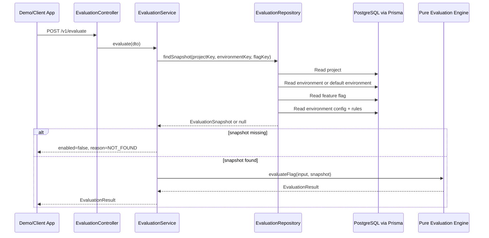

# Data-Plane API and Evaluation Engine — Phase 4 Learning Guide

This document explains the Phase 4 data-plane API and evaluation engine from
scratch. It focuses on how `POST /v1/evaluate` turns a project key, flag key,
optional environment key, and runtime context into a deterministic feature
decision.

Primary implementation files:

```text
apps/backend/src/evaluation/
├── dto/
│   ├── evaluate-request.dto.ts
│   └── evaluate-response.dto.ts
├── engine/
│   ├── evaluation.types.ts
│   ├── evaluation-engine.ts
│   ├── evaluation-engine.spec.ts
│   ├── stable-rollout-hash.ts
│   └── stable-rollout-hash.spec.ts
├── evaluation.controller.ts
├── evaluation.module.ts
├── evaluation.repository.ts
└── evaluation.service.ts
```

Supporting Phase 3 foundation files:

```text
apps/backend/src/main.ts
apps/backend/src/app.module.ts
apps/backend/src/common/
apps/backend/src/database/
```

## 1. What Phase 4 Added

Phase 4 implemented the read-only runtime decision path:

```http
POST /v1/evaluate
```

It added:

1. request and response DTOs,
2. a pure evaluation engine,
3. stable percentage rollout hashing,
4. reason code mapping,
5. a read-only evaluation repository,
6. an evaluation service that fails safely,
7. a NestJS controller/module,
8. unit tests for deterministic evaluation behavior.

Phase 4 did **not** add:

1. project management APIs,
2. feature flag CRUD APIs,
3. rule management APIs,
4. admin dashboard API integration,
5. demo app API integration,
6. audit writes for evaluation.

Important:

> Evaluation is data-plane and read-only. It should not write audit logs.
> Audit logs are for control-plane configuration mutations.

## 2. What “Data Plane” Means

The platform has two major sides:

| Side | Purpose | Examples |
| --- | --- | --- |
| Control plane | Manage configuration | Admin UI, project API, flag API, rule API, audit API |
| Data plane | Answer runtime decisions | `POST /v1/evaluate`, rule engine |

The data plane answers one question:

> For this project, environment, flag, and runtime context, should the feature
> be On or Off?

It must be:

- deterministic,
- fast enough for runtime use,
- safe by default,
- read-only,
- careful with user context and PII.

## 3. End-to-End Evaluation Flow



The controller does not evaluate rules. The repository does not decide the
result. The engine does not query the database. Each layer has one job.

## 4. API Contract

### 4.1 Endpoint

```http
POST /v1/evaluate
```

Why `/v1`?

- `main.ts` sets a global API prefix from `API_PREFIX`.
- `API_PREFIX` is currently `v1`.
- `EvaluationController` is mounted at `evaluate`.

So:

```text
global prefix /v1 + controller evaluate = /v1/evaluate
```

### 4.2 Example request

```json
{
  "projectKey": "demo-project",
  "environmentKey": "production",
  "flagKey": "new-checkout",
  "context": {
    "targetingKey": "demo-user-beta",
    "userId": "demo-user-beta",
    "roles": ["beta-tester"],
    "attributes": {
      "plan": "pro"
    }
  }
}
```

### 4.3 Request fields

| Field | Required | Meaning |
| --- | --- | --- |
| `projectKey` | Yes | Stable project key. |
| `environmentKey` | No | Environment key; if omitted, default environment is used. |
| `flagKey` | Yes | Stable flag key inside the project. |
| `context` | Yes | Runtime evaluation context. |
| `context.targetingKey` | Required only if percentage rollout is reached | Stable non-PII rollout key. |
| `context.userId` | No | Identifier for user allowlist rules. |
| `context.roles` | No | Role keys for role targeting. |
| `context.attributes` | No | Reserved for future non-PII attributes. |

### 4.4 Example response

```json
{
  "projectKey": "demo-project",
  "flagKey": "new-checkout",
  "enabled": true,
  "variant": "on",
  "reason": "ROLE_MATCH",
  "matchedRuleId": "rule_123"
}
```

### 4.5 Response fields

| Field | Meaning |
| --- | --- |
| `projectKey` | Echoes the requested project key. |
| `flagKey` | Echoes the requested flag key. |
| `enabled` | Runtime On/Off decision. |
| `variant` | MVP boolean variant: `on` or `off`. |
| `reason` | Why the decision happened. |
| `matchedRuleId` | Rule ID if a rule matched; otherwise `null`. |

For MVP boolean flags:

```text
enabled=true  -> variant=on
enabled=false -> variant=off
```

The database does not store variants yet. `variant` is derived from `enabled`.

## 5. Validation Behavior

Request validation is handled by:

```text
apps/backend/src/evaluation/dto/evaluate-request.dto.ts
apps/backend/src/main.ts
```

`EvaluateRequestDto` validates:

- `projectKey` is a valid key,
- optional `environmentKey` is a valid key,
- `flagKey` is a valid key,
- `context` is an object,
- optional `targetingKey` and `userId` are strings,
- optional `roles` is an array of strings,
- optional `attributes` is an object.

The key regex is:

```ts
^[a-z0-9][a-z0-9-]{1,62}[a-z0-9]$
```

Meaning:

- 3 to 64 characters,
- lowercase letters, numbers, and dashes,
- starts and ends with lowercase letter or number,
- no spaces,
- no underscores,
- no uppercase letters.

### 5.1 Invalid request shape

Invalid request shape returns management-style error:

```http
400 VALIDATION_ERROR
```

Example invalid request:

```json
{
  "projectKey": "Demo Project",
  "flagKey": "new_checkout",
  "context": "not-an-object"
}
```

### 5.2 Valid request but missing data

Valid request shape with missing project, environment, flag, or flag config
returns evaluation-shaped safe response:

```http
200 OK
```

```json
{
  "projectKey": "demo-project",
  "flagKey": "missing-flag",
  "enabled": false,
  "variant": "off",
  "reason": "NOT_FOUND",
  "matchedRuleId": null
}
```

This is intentional. Data-plane clients need a safe feature decision, not a
crashing runtime path.

## 6. Environment Handling

Phase 2 added environment-aware flag config. Phase 4 evaluation supports it.

Behavior:

| Request | Repository behavior |
| --- | --- |
| `environmentKey` provided | Find that environment in the project. |
| `environmentKey` omitted | Find the default environment in the project. |
| Environment missing | Return `NOT_FOUND`. |
| Flag config missing for environment | Return `NOT_FOUND`. |

Why this matters:

- `new-checkout` can be targeted in production,
- the same flag can be global-on in staging,
- evaluation remains safe if no config exists.

Current docs caveat:

> `docs/design/mvp-api-and-contracts.md` may need a follow-up update to fully
> document optional `environmentKey` defaulting behavior because environments
> were added after the first API contract.

## 7. Layer-by-Layer Code Map

### 7.1 `EvaluationController`

File:

```text
apps/backend/src/evaluation/evaluation.controller.ts
```

Main job:

> Receive HTTP request and call `EvaluationService`.

Important code shape:

```ts
@Controller('evaluate')
export class EvaluationController {
  @Post()
  @HttpCode(HttpStatus.OK)
  evaluate(@Body() body: EvaluateRequestDto): Promise<EvaluateResponseDto> {
    return this.evaluationService.evaluate(body);
  }
}
```

What it should not do:

- no database queries,
- no hashing,
- no rule matching,
- no audit writes.

### 7.2 `EvaluationService`

File:

```text
apps/backend/src/evaluation/evaluation.service.ts
```

Main job:

> Orchestrate repository lookup and engine execution.

Responsibilities:

1. Convert DTO to `EvaluationInput`.
2. Ask repository for an evaluation snapshot.
3. Return `NOT_FOUND` if the snapshot is missing.
4. Call the pure engine when snapshot exists.
5. Catch unexpected errors and return safe `ERROR`.
6. Log unexpected failures with request ID.

Safe failure behavior:

```ts
try {
  // load snapshot and evaluate
} catch (error) {
  logger.error(...requestId...);
  return errorResult(input);
}
```

### 7.3 `EvaluationRepository`

File:

```text
apps/backend/src/evaluation/evaluation.repository.ts
```

Main job:

> Read just enough database state to evaluate a flag.

Lookup order:

1. project by `projectKey`,
2. environment by `environmentKey` or `isDefault=true`,
3. feature flag by `projectId + flagKey`,
4. flag environment config by `flagId + environmentId`,
5. rules ordered by priority.

It returns:

```ts
EvaluationSnapshot | null
```

It returns `null` when any required record is missing.

What it should not do:

- no decision logic,
- no reason code mapping,
- no fallback response building,
- no audit writes.

### 7.4 Pure evaluation engine

Files:

```text
apps/backend/src/evaluation/engine/evaluation-engine.ts
apps/backend/src/evaluation/engine/evaluation.types.ts
```

Main job:

> Convert `EvaluationInput + EvaluationSnapshot` into `EvaluationResult`.

The engine is pure:

- no NestJS decorators,
- no Prisma client,
- no HTTP response objects,
- no database access,
- no logging,
- no mutation.

This makes it easy to unit test.

### 7.5 Stable rollout hash

File:

```text
apps/backend/src/evaluation/engine/stable-rollout-hash.ts
```

Main job:

> Convert project, flag, and targeting key into a stable bucket percentage.

It uses:

- Node `crypto`,
- SHA-256,
- first 8 bytes,
- modulo `10000`,
- division by `100`.

## 8. Evaluation Input, Snapshot, and Result

### 8.1 `EvaluationInput`

Represents request data needed by the engine:

```ts
{
  projectKey: string;
  flagKey: string;
  context: {
    targetingKey?: string;
    userId?: string;
    roles?: string[];
    attributes?: Record<string, unknown>;
  };
}
```

Notice:

> `environmentKey` is not part of `EvaluationInput` because the engine does not
> need it after the repository loads the correct environment-specific snapshot.

### 8.2 `EvaluationSnapshot`

Represents database state needed by the engine:

```ts
{
  flag: {
    lifecycleStatus: ACTIVE | ARCHIVED;
  };
  config: {
    status: ENABLED | DISABLED;
    servingMode: GLOBAL_ON | TARGETED;
    killSwitch: boolean;
  };
  rules: EvaluationRule[];
}
```

This is a snapshot, not a database model. It is intentionally smaller than the
full Prisma schema.

### 8.3 `EvaluationResult`

Final engine output:

```ts
{
  projectKey: string;
  flagKey: string;
  enabled: boolean;
  variant: 'on' | 'off';
  reason: EvaluationReason;
  matchedRuleId: string | null;
}
```

This shape matches the API response.

## 9. Reason Codes

Current reason enum:

```text
GLOBAL_ON
FLAG_DISABLED
FLAG_ARCHIVED
KILL_SWITCH
USER_ALLOWLIST
ROLE_MATCH
PERCENTAGE_ROLLOUT
DEFAULT_OFF
NOT_FOUND
INVALID_CONTEXT
ERROR
```

| Reason | Enabled? | Meaning |
| --- | --- | --- |
| `GLOBAL_ON` | true | Config serves feature to everyone. |
| `FLAG_DISABLED` | false | Environment config is disabled. |
| `FLAG_ARCHIVED` | false | Flag lifecycle is archived. |
| `KILL_SWITCH` | false | Kill switch forces Off. |
| `USER_ALLOWLIST` | true | `context.userId` matched allowlist. |
| `ROLE_MATCH` | true | At least one context role matched. |
| `PERCENTAGE_ROLLOUT` | true | Targeting key bucket is inside rollout percentage. |
| `DEFAULT_OFF` | false | No enabling rule matched. |
| `NOT_FOUND` | false | Project/environment/flag/config missing. |
| `INVALID_CONTEXT` | false | Percentage rule reached without usable targeting key. |
| `ERROR` | false | Unexpected recoverable error failed closed. |

## 10. Evaluation Order

The engine applies this order:

```text
1. Archived flag
2. Disabled config
3. Kill switch
4. Global-on serving mode
5. User allowlist rules
6. Role targeting rules
7. Percentage rollout rules
8. Default off
```

Missing project/environment/flag/config is handled before the engine by the
repository/service boundary:

```text
missing snapshot -> NOT_FOUND
```

Unexpected errors are handled by the service:

```text
unexpected exception -> ERROR
```

### 10.1 Why Off conditions come first

Archive, disabled config, and kill switch must win before any rule. Their
precedence is intentional: `FLAG_ARCHIVED` wins first, followed by
`FLAG_DISABLED`, then `KILL_SWITCH`.

Reason:

- archive means the flag should no longer serve,
- disabled config means this environment should not serve the feature,
- kill switch is emergency rollback for an otherwise enabled configuration.

Phase 12 may insert `GROUP_KILL_SWITCH` between `FLAG_DISABLED` and
`KILL_SWITCH`. Do not expose that reason code until group kill-switch behavior
is implemented.

### 10.2 Why global-on comes before targeting

If config is `GLOBAL_ON`, the feature is enabled for everyone in that
environment. There is no need to check allowlist, roles, or percentage rollout.

### 10.3 Why rule type precedence beats priority

The implementation sorts enabled rules by priority, but evaluates by broad rule
type:

1. user allowlist,
2. role targeting,
3. percentage rollout.

This means:

> A role rule with priority `1` cannot outrank a user allowlist rule with
> priority `99`.

Tests explicitly cover this behavior.

Within the same rule type, lower priority is evaluated first.

## 11. Stable Percentage Rollout

Percentage rollout must be deterministic. It must not use:

```ts
Math.random()
```

### 11.1 Hash input

```text
${projectKey}:${flagKey}:${targetingKey}
```

Example:

```text
demo-project:new-checkout:demo-user-regular
```

### 11.2 Hash algorithm

Implementation steps:

1. Trim surrounding whitespace from `targetingKey`.
2. Build hash input.
3. Compute SHA-256 digest.
4. Read first 8 bytes as unsigned big-endian integer.
5. Compute `bucket = first64Bits % 10000`.
6. Compute `bucketPercentage = bucket / 100`.
7. Match when `bucketPercentage < percentage`.

Bucket range:

```text
0.00 to 99.99
```

### 11.3 Percentage validation

Valid percentage:

- number,
- finite,
- `0 <= percentage <= 100`,
- max two decimal places.

Valid examples:

```text
0
25
50.5
99.99
100
```

Invalid examples:

```text
-1
100.01
25.123
"25"
NaN
Infinity
```

### 11.4 Edge cases

| Percentage | Behavior |
| --- | --- |
| `0` | Never matches. |
| `100` | Always matches if percentage rule is reached. |
| invalid percentage | Rule is skipped. |
| missing `targetingKey` when percentage rules exist | `INVALID_CONTEXT`. |

## 12. Rule Parameter Shapes

Rule parameters are stored as JSONB in PostgreSQL, so the engine must safely
inspect their shape.

### 12.1 User allowlist

Expected parameters:

```json
{
  "userIds": ["demo-user-admin"]
}
```

Match condition:

```text
context.userId is present
and parameters.userIds includes context.userId
```

If `context.userId` is missing, allowlist rules cannot match and are skipped.

### 12.2 Role targeting

Expected parameters:

```json
{
  "roles": ["beta-tester"]
}
```

Match condition:

```text
context.roles contains at least one role listed by the rule
```

If `context.roles` is missing or empty, role rules cannot match and are
skipped.

### 12.3 Percentage rollout

Expected parameters:

```json
{
  "percentage": 50
}
```

Match condition:

```text
stable bucket percentage < rule percentage
```

If a percentage rule is reached but `context.targetingKey` is missing or empty,
evaluation returns `INVALID_CONTEXT`.

## 13. Safe Defaults and Failure Modes

Evaluation must fail closed.

| Case | Response |
| --- | --- |
| Missing project | `enabled=false`, `reason=NOT_FOUND` |
| Missing environment | `enabled=false`, `reason=NOT_FOUND` |
| Missing flag | `enabled=false`, `reason=NOT_FOUND` |
| Missing flag config | `enabled=false`, `reason=NOT_FOUND` |
| Archived flag | `enabled=false`, `reason=FLAG_ARCHIVED` |
| Config disabled | `enabled=false`, `reason=FLAG_DISABLED` |
| Kill switch on | `enabled=false`, `reason=KILL_SWITCH` |
| No rules match | `enabled=false`, `reason=DEFAULT_OFF` |
| Percentage reached without targeting key | `enabled=false`, `reason=INVALID_CONTEXT` |
| Unexpected service/repository error | `enabled=false`, `reason=ERROR` |

This is the core safety promise of the data plane.

## 14. Request ID and Error Handling

Phase 3 foundation supports request context.

Files:

```text
apps/backend/src/common/middleware/request-context.middleware.ts
apps/backend/src/common/request-context/request-context.service.ts
apps/backend/src/common/filters/api-exception.filter.ts
```

Behavior:

- if client sends `X-Request-Id`, backend uses it,
- otherwise backend generates one,
- response includes `X-Request-Id`,
- unexpected evaluation errors are logged with request ID,
- validation errors return structured `VALIDATION_ERROR`.

Evaluation-shaped fallbacks such as `NOT_FOUND`, `INVALID_CONTEXT`, and
`ERROR` are normal data-plane responses, not thrown HTTP exceptions.

## 15. Swagger Documentation

Swagger is configured in:

```text
apps/backend/src/main.ts
```

Local docs path:

```text
http://localhost:3000/docs
```

The evaluation DTOs use `@ApiProperty` decorators so the endpoint appears with
request/response metadata.

Important TypeScript detail:

- `EvaluationReason` is a runtime enum and is imported normally.
- `EvaluationVariant` is a type alias and is imported with `import type`.

This avoids decorator metadata issues.

## 16. Unit Test Map

Phase 4 tests live in:

```text
apps/backend/src/evaluation/engine/evaluation-engine.spec.ts
apps/backend/src/evaluation/engine/stable-rollout-hash.spec.ts
```

Covered behaviors include:

- `NOT_FOUND` result helper,
- `ERROR` result helper,
- archived flag,
- kill switch,
- disabled config,
- global-on config,
- user allowlist match,
- allowlist skipped without user ID,
- role match,
- percentage rollout missing targeting key,
- percentage `0`,
- percentage `100`,
- deterministic repeat result,
- disabled rules skipped,
- type precedence before cross-type priority,
- lower priority first within same rule type,
- default off when no rule matches,
- stable hash same input same bucket,
- bucket range,
- targeting key trimming and case preservation,
- percentage validation.

Run focused tests:

```bash
npm run test --workspace=@ffp/backend -- evaluation
```

Run all backend tests:

```bash
npm run test --workspace=@ffp/backend
```

## 17. Manual Smoke Tests

Before smoke testing:

```bash
docker start ffp-postgres
npm run prisma:migrate --workspace=@ffp/backend
npm run db:seed --workspace=@ffp/backend
npm run dev:backend
```

### 17.1 Health check

```bash
curl -i http://localhost:3000/v1/health
```

Expected:

```json
{
  "status": "ok",
  "service": "feature-flag-backend"
}
```

### 17.2 Global-on seeded flag

```bash
curl -i -X POST http://localhost:3000/v1/evaluate \
  -H "Content-Type: application/json" \
  -d '{
    "projectKey": "demo-project",
    "environmentKey": "production",
    "flagKey": "beta-dashboard",
    "context": {
      "targetingKey": "demo-user-regular",
      "userId": "demo-user-regular",
      "roles": ["user"]
    }
  }'
```

Expected:

```text
enabled=true
variant=on
reason=GLOBAL_ON
```

### 17.3 Role-targeting seeded flag

```bash
curl -i -X POST http://localhost:3000/v1/evaluate \
  -H "Content-Type: application/json" \
  -d '{
    "projectKey": "demo-project",
    "environmentKey": "production",
    "flagKey": "new-checkout",
    "context": {
      "targetingKey": "demo-user-beta",
      "userId": "demo-user-beta",
      "roles": ["beta-tester"]
    }
  }'
```

Expected:

```text
enabled=true
reason=ROLE_MATCH
matchedRuleId is not null
```

### 17.4 Allowlist seeded flag

```bash
curl -i -X POST http://localhost:3000/v1/evaluate \
  -H "Content-Type: application/json" \
  -d '{
    "projectKey": "demo-project",
    "environmentKey": "production",
    "flagKey": "new-checkout",
    "context": {
      "targetingKey": "demo-user-admin",
      "userId": "demo-user-admin",
      "roles": ["admin"]
    }
  }'
```

Expected:

```text
enabled=true
reason=USER_ALLOWLIST
matchedRuleId is not null
```

### 17.5 Missing flag

```bash
curl -i -X POST http://localhost:3000/v1/evaluate \
  -H "Content-Type: application/json" \
  -d '{
    "projectKey": "demo-project",
    "environmentKey": "production",
    "flagKey": "missing-flag",
    "context": {
      "targetingKey": "demo-user-regular"
    }
  }'
```

Expected:

```text
HTTP 200
enabled=false
variant=off
reason=NOT_FOUND
```

## 18. What to Unlearn

| Wrong assumption | Correct understanding |
| --- | --- |
| Evaluation should return `404` for missing flag | Data plane returns `200` with `enabled=false`, `reason=NOT_FOUND`. |
| Evaluation should write audit logs | Evaluation is read-only; audit logs are for configuration mutations. |
| Rule priority can override all rule types | Type precedence wins; priority orders rules within the same type. |
| Percentage rollout can use randomness | It must use stable SHA-256 hashing. |
| `ENABLED` config means every user sees the feature | Config enabled only allows evaluation to proceed; rules may still return Off. |
| `environmentKey` is always required | It is optional; repository falls back to the default environment. |
| The engine should query Prisma | The engine is pure and receives a snapshot. |
| `targetingKey` can be an email | Use stable non-PII rollout keys. |

## 19. How to Read the Code Step by Step

### Step 1 — Start with DTOs

Read:

```text
apps/backend/src/evaluation/dto/evaluate-request.dto.ts
apps/backend/src/evaluation/dto/evaluate-response.dto.ts
```

Goal:

> Understand the HTTP contract and validation shape.

### Step 2 — Read domain types

Read:

```text
apps/backend/src/evaluation/engine/evaluation.types.ts
```

Goal:

> Understand input, snapshot, result, and reason codes.

### Step 3 — Read stable hashing

Read:

```text
apps/backend/src/evaluation/engine/stable-rollout-hash.ts
apps/backend/src/evaluation/engine/stable-rollout-hash.spec.ts
```

Goal:

> Understand deterministic rollout buckets.

### Step 4 — Read the engine

Read:

```text
apps/backend/src/evaluation/engine/evaluation-engine.ts
apps/backend/src/evaluation/engine/evaluation-engine.spec.ts
```

Goal:

> Understand rule order and safe outcomes.

### Step 5 — Read repository and service

Read:

```text
apps/backend/src/evaluation/evaluation.repository.ts
apps/backend/src/evaluation/evaluation.service.ts
```

Goal:

> Understand database snapshot loading and safe orchestration.

### Step 6 — Read controller and module

Read:

```text
apps/backend/src/evaluation/evaluation.controller.ts
apps/backend/src/evaluation/evaluation.module.ts
apps/backend/src/app.module.ts
```

Goal:

> Understand how NestJS exposes the endpoint.

## 20. Phase 4 Readiness Checklist

Use this checklist to confirm Phase 4 behavior:

```text
[ ] POST /v1/evaluate exists.
[ ] DTO validates projectKey, environmentKey, flagKey, and context shape.
[ ] Invalid keys return 400 VALIDATION_ERROR.
[ ] Missing project/environment/flag/config returns 200 NOT_FOUND result.
[ ] Engine returns FLAG_ARCHIVED before FLAG_DISABLED.
[ ] Engine returns FLAG_DISABLED before KILL_SWITCH.
[ ] Engine returns KILL_SWITCH before GLOBAL_ON and targeted rules.
[ ] User allowlist rules are evaluated before role and percentage rules.
[ ] Role targeting rules are evaluated before percentage rules.
[ ] Percentage rollout uses stable SHA-256 hashing.
[ ] Same input returns same percentage rollout result.
[ ] Missing targetingKey returns INVALID_CONTEXT only when percentage rule is reached.
[ ] No matching rule returns DEFAULT_OFF.
[ ] Unexpected errors return ERROR safely.
[ ] Evaluation repository is read-only.
[ ] Evaluation flow does not write audit logs.
[ ] Engine tests pass.
```

Useful commands:

```bash
npm run test --workspace=@ffp/backend -- evaluation
npm run test --workspace=@ffp/backend
npm run build --workspace=@ffp/backend
npm run lint --workspace=@ffp/backend
npm run diff:check
```

## 21. One-Sentence Summary

The Phase 4 data-plane API receives `POST /v1/evaluate`, validates the request,
loads an environment-aware flag snapshot from PostgreSQL, evaluates it through a
pure deterministic rule engine, and always returns a safe On/Off result with a
clear reason code.
