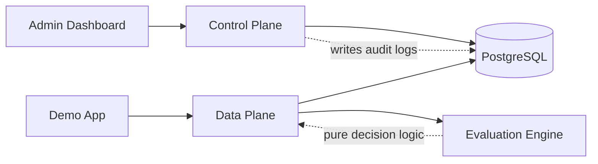
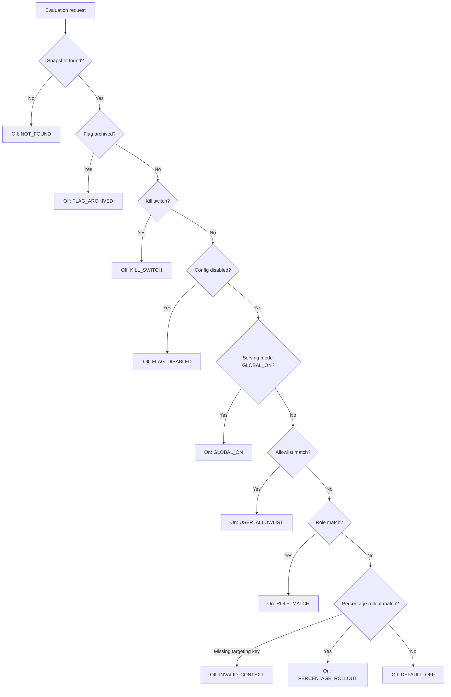

# Domain Logic — Feature Flag Platform

This document explains the domain logic of this repository from scratch. It is
written for learning after Phase 4 and Phase 5 of
`docs/plan/implementation-roadmap.md`, where the backend now has:

- deterministic data-plane evaluation,
- control-plane management APIs,
- Prisma/PostgreSQL persistence,
- validation and error handling,
- transactional audit logs.

Use this guide when you want to understand **why the code behaves the way it
behaves**, not just where files are located.

## 1. What “Domain Logic” Means Here

Domain logic is the project-specific business behavior. It answers questions
like:

- What is a project?
- What is a feature flag?
- What makes a flag On or Off for a user?
- What is the correct rule order?
- When should an API return `NOT_FOUND`?
- Which changes must be audited?
- Why is a stable non-PII targeting key required?

In this project, domain logic is mostly inside:

```text
apps/backend/src/evaluation/
apps/backend/src/projects/
apps/backend/src/feature-flags/
apps/backend/src/flag-rules/
apps/backend/src/sample-users/
apps/backend/src/audit/
apps/backend/src/audit-logs/
apps/backend/prisma/schema.prisma
```

There is not yet a separate `domain/` package. The current architecture keeps
pure-ish evaluation logic in `evaluation/engine/`, while control-plane domain
workflows live in NestJS services.

## 2. The Core Domain Story

The platform exists to demonstrate this release-management loop:

```text
Create a project
-> create a feature flag
-> configure its runtime behavior
-> add ordered targeting rules
-> evaluate the flag for a runtime context
-> return a deterministic On/Off decision
-> keep an audit trail of configuration changes
```

The shortest explanation is:

> Admin users configure flags in the control plane. Applications ask the data
> plane whether a feature should be enabled. The result is deterministic, safe
> by default, and configuration changes are auditable.

## 3. Domain Vocabulary

| Term | Meaning in this repo |
| --- | --- |
| Project | Top-level container for flags, environments, sample users, and audit logs. |
| Environment | Runtime scope such as `production`, `staging`, or `development`. |
| Feature flag | Stable feature identity, for example `new-checkout`. |
| Flag environment config | Per-environment runtime config for one flag. |
| Rule | Ordered targeting condition such as allowlist, role match, or percentage rollout. |
| Sample user | Demo-only non-PII context used to test evaluation. |
| Evaluation context | Runtime input sent to `POST /v1/evaluate`. |
| Targeting key | Stable non-PII string used for deterministic percentage rollout. |
| Actor | Person/system making a config change, supplied by `X-Actor`. |
| Audit log | Append-only record of a configuration mutation. |
| Control plane | APIs that manage configuration. |
| Data plane | API that returns runtime flag decisions. |

## 4. Domain Boundary: Control Plane vs Data Plane

This project intentionally separates configuration from runtime decisions.



### 4.1 Control plane

The control plane changes or reads configuration.

Current control-plane APIs:

```text
GET    /v1/projects
POST   /v1/projects
GET    /v1/projects/:projectKey
PATCH  /v1/projects/:projectKey

GET    /v1/projects/:projectKey/flags
POST   /v1/projects/:projectKey/flags
GET    /v1/projects/:projectKey/flags/:flagKey
PATCH  /v1/projects/:projectKey/flags/:flagKey
POST   /v1/projects/:projectKey/flags/:flagKey/archive
POST   /v1/projects/:projectKey/flags/:flagKey/restore

GET    /v1/projects/:projectKey/flags/:flagKey/rules
PUT    /v1/projects/:projectKey/flags/:flagKey/rules

GET    /v1/projects/:projectKey/sample-users
POST   /v1/projects/:projectKey/sample-users
DELETE /v1/projects/:projectKey/sample-users/:targetingKey

GET    /v1/projects/:projectKey/audit-logs
```

### 4.2 Data plane

The data plane evaluates a flag for a runtime context.

Current data-plane API:

```text
POST /v1/evaluate
```

The data plane must be:

- deterministic,
- safe by default,
- free from random rollout decisions,
- explicit about reason codes,
- separate from admin configuration behavior.

## 5. The Data Model as Domain Logic

The Prisma schema is not just storage. It encodes important domain rules.

Main models:

```text
Project
Environment
FeatureFlag
FlagEnvironmentConfig
FlagRule
SampleUserContext
AuditLogEntry
```

### 5.1 Project

A project is the top-level namespace.

Rules:

- `Project.key` is unique globally.
- Other resources usually belong to exactly one project.
- API routes use `projectKey` because it is stable and human-readable.

File:

```text
apps/backend/prisma/schema.prisma
```

Service:

```text
apps/backend/src/projects/projects.service.ts
```

### 5.2 Environment

An environment scopes runtime behavior.

Rules:

- environment keys are unique inside a project,
- one default environment exists per project,
- `POST /v1/evaluate` uses the default environment when no `environmentKey` is
  provided,
- Phase 5 project creation currently creates a default `production`
  environment.

Why this matters:

> A flag can be safe in production while being tested differently in staging.

### 5.3 FeatureFlag

A feature flag is the stable identity of a feature.

It stores:

- key,
- name,
- description,
- lifecycle status,
- archived timestamp.

Domain rules:

- `FeatureFlag(projectId, key)` is unique,
- key is immutable through current APIs,
- lifecycle is separate from runtime config,
- archived flags evaluate Off with reason `FLAG_ARCHIVED`.

### 5.4 FlagEnvironmentConfig

This stores how a flag behaves in one environment.

It stores:

- `status`: `ENABLED` or `DISABLED`,
- `servingMode`: `GLOBAL_ON` or `TARGETED`,
- `killSwitch`: boolean,
- links to project, flag, and environment.

Domain rules:

- one config exists per flag/environment pair,
- config status is not the same as runtime On/Off,
- disabled config evaluates Off with reason `FLAG_DISABLED`,
- kill switch evaluates Off with reason `KILL_SWITCH`,
- global-on evaluates On with reason `GLOBAL_ON`.

### 5.5 FlagRule

Rules store ordered targeting behavior.

Fields:

```text
type
priority
enabled
parameters
```

Domain rules:

- `priority` controls order,
- priorities must be unique per flag config,
- disabled rules are skipped,
- parameters are JSON because each rule type needs different fields,
- current MVP rule types are:
  - `USER_ALLOWLIST`,
  - `ROLE_TARGETING`,
  - `PERCENTAGE_ROLLOUT`.

### 5.6 SampleUserContext

Sample users are demo helpers, not real users.

They store:

- display name,
- targeting key,
- optional synthetic user ID,
- roles,
- attributes.

Domain rules:

- `targetingKey` is unique per project,
- targeting keys must be stable and non-PII,
- roles are normalized by trimming and removing duplicates,
- sample users make demo scenarios repeatable.

### 5.7 AuditLogEntry

Audit logs store configuration history.

They store:

- project and environment context,
- target type and target key,
- action,
- actor,
- before snapshot,
- after snapshot,
- metadata,
- request ID,
- creation timestamp.

Domain rules:

- audit logs are append-only,
- mutation and audit insert must happen in the same transaction,
- update/delete are blocked at database level by migration triggers,
- audit logs are queried by project, target, actor, action, and time range.

## 6. Domain Invariants

An invariant is a rule that should always remain true.

| Invariant | Enforced by |
| --- | --- |
| Project keys are unique. | Prisma schema/database unique constraint. |
| Feature flag keys are unique inside a project. | Prisma schema/database unique constraint. |
| Environment keys are unique inside a project. | Prisma schema/database unique constraint. |
| A project has only one default environment. | Migration constraint. |
| Rule priority is unique inside one flag config. | Prisma schema/database unique constraint and service validation. |
| Evaluation is deterministic. | Evaluation engine and stable hash tests. |
| Missing flag/project fails closed. | `EvaluationService` returns `notFoundResult`. |
| Mutations require an actor. | `ActorRequiredGuard` and service checks. |
| Mutations are audited. | Service workflows plus `AuditLogService`. |
| Audit rows cannot be edited or deleted. | Database triggers from migration SQL. |

## 7. Evaluation Domain Logic

Evaluation is the most important runtime domain behavior.

Files:

```text
apps/backend/src/evaluation/evaluation.controller.ts
apps/backend/src/evaluation/evaluation.service.ts
apps/backend/src/evaluation/evaluation.repository.ts
apps/backend/src/evaluation/engine/evaluation-engine.ts
apps/backend/src/evaluation/engine/evaluation.types.ts
apps/backend/src/evaluation/engine/stable-rollout-hash.ts
```

### 7.1 Evaluation input

A client sends:

```json
{
  "projectKey": "demo-project",
  "environmentKey": "production",
  "flagKey": "new-checkout",
  "context": {
    "targetingKey": "demo-user-beta",
    "userId": "demo-user-beta",
    "roles": ["beta-tester"],
    "attributes": {
      "plan": "pro",
      "country": "VN"
    }
  }
}
```

Meaning:

| Field | Domain meaning |
| --- | --- |
| `projectKey` | Which project namespace to evaluate in. |
| `environmentKey` | Optional runtime environment. Defaults to project default environment. |
| `flagKey` | Which feature flag to evaluate. |
| `context.targetingKey` | Stable rollout key for percentage rollout. |
| `context.userId` | Synthetic ID used by allowlist rules. |
| `context.roles` | Role keys used by role-targeting rules. |
| `context.attributes` | Reserved non-PII attributes for future rules. |

### 7.2 Evaluation output

The engine returns:

```json
{
  "projectKey": "demo-project",
  "flagKey": "new-checkout",
  "enabled": true,
  "variant": "on",
  "reason": "ROLE_MATCH",
  "matchedRuleId": "rule_123"
}
```

Meaning:

| Field | Domain meaning |
| --- | --- |
| `enabled` | Runtime decision. This is the actual On/Off result. |
| `variant` | Current MVP maps true to `on` and false to `off`. |
| `reason` | Why the decision happened. Useful for demo and debugging. |
| `matchedRuleId` | Rule that caused the decision, or `null` for global/default/system reasons. |

### 7.3 Snapshot loading

Before the pure engine runs, the repository loads a snapshot:

```text
project
-> environment or default environment
-> feature flag
-> flag environment config
-> ordered rules
```

If any required piece is missing, evaluation returns:

```json
{
  "enabled": false,
  "reason": "NOT_FOUND"
}
```

This is a domain decision:

> Application clients should fail closed. A missing config should not expose a
> feature by accident.

### 7.4 Evaluation order

Current implemented order in `evaluateFlag`:

1. If flag is archived -> Off, `FLAG_ARCHIVED`.
2. If kill switch is enabled -> Off, `KILL_SWITCH`.
3. If config status is disabled -> Off, `FLAG_DISABLED`.
4. If serving mode is global-on -> On, `GLOBAL_ON`.
5. Evaluate enabled allowlist rules -> On, `USER_ALLOWLIST`.
6. Evaluate enabled role targeting rules -> On, `ROLE_MATCH`.
7. Evaluate enabled percentage rollout rules -> On, `PERCENTAGE_ROLLOUT`, or
   Off with `INVALID_CONTEXT` if rollout requires a missing targeting key.
8. If nothing matches -> Off, `DEFAULT_OFF`.

Mermaid view:



### 7.5 Important subtlety: rule priority vs rule category

Rules are sorted by priority, but the current engine evaluates by rule category:

```text
all allowlist rules
-> all role targeting rules
-> all percentage rollout rules
```

That means the MVP domain order prioritizes rule type categories over a fully
mixed priority list.

Example:

- role rule priority `10`,
- allowlist rule priority `20`.

The engine still checks allowlist rules before role rules because the domain
order says allowlist comes first.

This matches the current project guardrail:

```text
global disable -> user allowlist -> role targeting -> percentage rollout -> default off
```

### 7.6 Reason codes

Implemented reason codes:

```text
GLOBAL_ON
FLAG_DISABLED
FLAG_ARCHIVED
KILL_SWITCH
USER_ALLOWLIST
ROLE_MATCH
PERCENTAGE_ROLLOUT
DEFAULT_OFF
NOT_FOUND
INVALID_CONTEXT
ERROR
```

Reason codes are domain language. They make the demo explainable and help
future UI screens say why a feature is On or Off.

## 8. Rule Type Domain Logic

Rule types are configured through control-plane APIs and interpreted by the
evaluation engine.

### 8.1 `USER_ALLOWLIST`

Expected parameters:

```json
{
  "userIds": ["demo-user-admin"]
}
```

Evaluation logic:

- requires `context.userId`,
- checks whether `userId` exists in `parameters.userIds`,
- returns On with reason `USER_ALLOWLIST` on match,
- skips rule if parameters are malformed.

Creation/update validation:

- `userIds` must be a non-empty array,
- each item must be a non-empty string.

### 8.2 `ROLE_TARGETING`

Expected parameters:

```json
{
  "roles": ["beta-tester"]
}
```

Evaluation logic:

- reads `context.roles`,
- checks whether any configured role is present in context roles,
- returns On with reason `ROLE_MATCH` on match,
- skips rule if parameters are malformed.

Creation/update validation:

- `roles` must be a non-empty array,
- each role must be a non-empty string.

### 8.3 `PERCENTAGE_ROLLOUT`

Expected parameters:

```json
{
  "percentage": 50
}
```

Evaluation logic:

- requires `context.targetingKey`,
- hashes `projectKey:flagKey:targetingKey`,
- converts hash to a bucket from `0.00` to `99.99`,
- returns On if `bucket < percentage`,
- returns default Off if bucket is outside the rollout percentage,
- returns `INVALID_CONTEXT` if a percentage rule exists but no targeting key is
  supplied.

Validation:

- percentage must be a number,
- range must be `0` through `100`,
- max precision is two decimal places.

Important examples:

| Percentage | Behavior |
| ---: | --- |
| `0` | Nobody is included by this rule. |
| `50` | Roughly half of stable targeting keys are included. |
| `100` | Everyone with a targeting key is included. |

## 9. Stable Rollout Hashing

File:

```text
apps/backend/src/evaluation/engine/stable-rollout-hash.ts
```

The hash input is:

```text
projectKey:flagKey:targetingKey
```

The algorithm:

1. Trim surrounding whitespace from `targetingKey`.
2. Build a string from project, flag, and targeting key.
3. Hash it with SHA-256.
4. Read the first 64 bits.
5. Convert that to a number from `0` to `9999`.
6. Divide by `100` to get `0.00` through `99.99`.

Why this matters:

- the same user gets the same result on repeated requests,
- rollout does not flicker,
- rollout is not random per request,
- no database write is needed during evaluation,
- no PII is required.

Important subtlety:

> The current hash trims whitespace but preserves case. `demo-user` and
> `Demo-User` are different targeting keys.

## 10. Feature Flag State Domain Logic

A feature flag has multiple state concepts. Do not merge them mentally.

| Concept | Values | Stored on | Meaning |
| --- | --- | --- | --- |
| Lifecycle status | `ACTIVE`, `ARCHIVED` | `FeatureFlag` | Is this flag still part of active configuration? |
| Config status | `ENABLED`, `DISABLED` | `FlagEnvironmentConfig` | Is this config eligible to serve On? |
| Serving mode | `GLOBAL_ON`, `TARGETED` | `FlagEnvironmentConfig` | Should config turn everyone On or evaluate rules? |
| Kill switch | `true`, `false` | `FlagEnvironmentConfig` | Emergency Off switch. |
| Runtime state | `enabled=true/false` | Evaluation response | Actual result for one context. |

### 10.1 Why `ENABLED` is not equal to On

A config can be `ENABLED` and still evaluate Off if:

- no rule matches,
- rollout bucket is outside the percentage,
- required targeting context is missing,
- flag is archived,
- kill switch is on.

So:

```text
ENABLED = allowed to evaluate
On = result of evaluation for this context
```

### 10.2 Why `GLOBAL_ON` is still below safety gates

`GLOBAL_ON` turns the feature On only after these checks pass:

1. flag is not archived,
2. kill switch is not enabled,
3. config is not disabled.

This gives emergency and lifecycle controls higher priority than convenience.

## 11. Control-Plane Domain Logic

Control-plane services own workflows that modify domain state.

Current services:

```text
projects/projects.service.ts
feature-flags/feature-flags.service.ts
flag-rules/flag-rules.service.ts
sample-users/sample-users.service.ts
audit-logs/audit-logs.service.ts
```

### 11.1 Project workflows

Project creation:

```text
validate key/name
-> reject duplicate key
-> begin transaction
-> create project
-> create default production environment
-> write PROJECT_CREATED audit log
-> commit
```

Project update:

```text
find existing project
-> update mutable fields
-> write PROJECT_UPDATED audit log with before/after
```

Domain decisions:

- project key is immutable,
- default environment is created with the project,
- create/update requires `X-Actor`,
- duplicate key is `CONFLICT`.

### 11.2 Feature flag workflows

Feature flag creation:

```text
find project
-> reject duplicate flag key inside project
-> find default environment
-> create feature flag
-> create default environment config as DISABLED + TARGETED + killSwitch false
-> write FEATURE_FLAG_CREATED audit log
```

Why new flags start disabled:

> Safe default. A new flag should not expose a feature until explicitly enabled.

Feature flag update:

```text
find project and flag
-> find default config
-> update flag metadata and config fields
-> read after snapshot
-> write FEATURE_FLAG_UPDATED audit log
```

Archive/restore:

```text
find project and flag
-> set lifecycle status and archivedAt
-> write FEATURE_FLAG_ARCHIVED or FEATURE_FLAG_RESTORED audit log
```

Domain decisions:

- archive is explicit, not accidental deletion,
- restore is explicit,
- default environment config is the current Phase 5 management target,
- config status is separate from lifecycle.

### 11.3 Rule replacement workflow

Rules are replaced as a set:

```text
validate all rules
-> require unique priorities
-> require valid parameters by rule type
-> begin transaction
-> find project, flag, default config
-> read before rules
-> delete old rules
-> create new rules
-> read after rules
-> write FLAG_RULES_REPLACED audit log
-> commit
```

Why replace as a set?

- simpler admin UI model,
- avoids partial rule ordering bugs,
- makes before/after audit snapshots easier to explain,
- keeps priorities stable and easy to reason about.

Domain decisions:

- duplicate priorities are rejected before writing,
- empty rule set is allowed and means targeted evaluation falls through to
  `DEFAULT_OFF`,
- invalid parameter shape is rejected before writing.

### 11.4 Sample user workflows

Sample user creation:

```text
trim displayName
-> trim targetingKey
-> trim optional userId
-> normalize roles
-> reject duplicate targetingKey in project
-> create sample user
-> write SAMPLE_USER_CREATED audit log
```

Sample user delete:

```text
trim targetingKey
-> find project and sample user
-> delete sample user
-> write SAMPLE_USER_DELETED audit log
```

Domain decisions:

- sample users are for demos, not identity management,
- stable targeting keys are required,
- roles are deduplicated,
- whitespace-only values are rejected.

### 11.5 Audit log query workflow

Audit logs are read with filters:

```text
find project
-> validate time range
-> build filter by target, actor, action, time
-> paginate
-> return items and page metadata
```

Domain decisions:

- audit logs are listed by project,
- `from` must be before or equal to `to`,
- audit API is read-only,
- append-only behavior is enforced by DB triggers, not just API convention.

## 12. Transactional Audit Logging Domain Logic

Audit logging is not optional decoration in this project. It is part of the
business behavior.

For configuration mutations, the domain rule is:

> If the configuration changes, the audit log must be written in the same
> transaction as the change.

### 12.1 Why same transaction matters

Without same-transaction audit logging, the system could have:

- changed config but missing audit entry,
- audit entry for a change that failed,
- inconsistent before/after history.

Same transaction gives this guarantee:

```text
mutation succeeds + audit succeeds
or
mutation fails + audit fails
```

### 12.2 Audit snapshot logic

Snapshots are cleaned by:

```text
apps/backend/src/common/utils/audit-snapshot.util.ts
```

It:

- removes `undefined`,
- keeps `null`,
- converts `Date` to ISO string,
- normalizes arrays and objects,
- converts unsupported primitive-like values to strings.

This helps make JSON snapshots stable and safe to store in PostgreSQL `jsonb`.

### 12.3 Audit target/action examples

| Mutation | Target type | Action |
| --- | --- | --- |
| Create project | `PROJECT` | `PROJECT_CREATED` |
| Update project | `PROJECT` | `PROJECT_UPDATED` |
| Create flag | `FEATURE_FLAG` | `FEATURE_FLAG_CREATED` |
| Update flag/config | `FEATURE_FLAG` | `FEATURE_FLAG_UPDATED` |
| Archive flag | `FEATURE_FLAG` | `FEATURE_FLAG_ARCHIVED` |
| Restore flag | `FEATURE_FLAG` | `FEATURE_FLAG_RESTORED` |
| Replace rules | `FEATURE_FLAG` | `FLAG_RULES_REPLACED` |
| Create sample user | `SAMPLE_USER` | `SAMPLE_USER_CREATED` |
| Delete sample user | `SAMPLE_USER` | `SAMPLE_USER_DELETED` |

## 13. API Domain Logic

API behavior is part of the domain because it defines how clients experience
business rules.

### 13.1 Key validation

Keys use:

```text
^[a-z0-9][a-z0-9-]{1,62}[a-z0-9]$
```

Meaning:

- 3 to 64 characters,
- lowercase letters,
- numbers,
- dashes,
- cannot start or end with dash.

This applies to `projectKey`, `flagKey`, and environment-style keys.

### 13.2 Error codes

Current API error codes:

```text
VALIDATION_ERROR
NOT_FOUND
CONFLICT
INTERNAL_ERROR
```

Control-plane missing resources usually throw HTTP `404` with `NOT_FOUND`.
Data-plane missing evaluation resources return HTTP `200` with:

```json
{
  "enabled": false,
  "reason": "NOT_FOUND"
}
```

This difference is intentional:

| Case | Behavior | Why |
| --- | --- | --- |
| Admin asks for missing project | HTTP 404 | Admin needs to fix configuration/navigation. |
| Runtime app evaluates missing flag | `enabled=false`, `NOT_FOUND` | App should fail closed without crashing feature flow. |

### 13.3 Pagination

List endpoints return:

```json
{
  "items": [],
  "page": {
    "limit": 20,
    "offset": 0,
    "total": 0,
    "hasNext": false
  }
}
```

Pagination is a domain/API rule because admin screens must be able to list
projects, flags, rules, sample users, and audit logs predictably.

## 14. Domain Logic by File

| File/folder | Domain responsibility |
| --- | --- |
| `prisma/schema.prisma` | Entity model, enums, uniqueness, relationships. |
| `evaluation/engine/evaluation-engine.ts` | Pure feature flag decision order. |
| `evaluation/engine/stable-rollout-hash.ts` | Deterministic percentage rollout. |
| `evaluation/evaluation.repository.ts` | Loads evaluation snapshot. |
| `evaluation/evaluation.service.ts` | Converts missing/error cases into safe results. |
| `projects/projects.service.ts` | Project creation/update and default environment creation. |
| `feature-flags/feature-flags.service.ts` | Flag lifecycle and default config mutation workflows. |
| `flag-rules/flag-rules.service.ts` | Rule validation and rule-set replacement. |
| `sample-users/sample-users.service.ts` | Demo user normalization and sample user audit workflows. |
| `audit/audit-log.service.ts` | Writes audit entries in transaction. |
| `audit-logs/audit-logs.service.ts` | Audit log filtering, sorting, and time range validation. |
| `common/guards/actor-required.guard.ts` | Enforces actor on mutation routes. |
| `common/request-context/request-context.service.ts` | Carries actor and request ID through workflows. |

## 15. End-to-End Domain Scenarios

### 15.1 New feature starts safely Off

```text
Admin creates flag
-> backend creates FeatureFlag
-> backend creates default config as DISABLED/TARGETED/killSwitch false
-> audit log records FEATURE_FLAG_CREATED
-> evaluation sees config DISABLED
-> returns enabled=false, reason=FLAG_DISABLED
```

Why this is correct:

> New features should not accidentally launch to users.

### 15.2 Enable for beta testers only

```text
Admin updates flag config to ENABLED/TARGETED
-> admin replaces rules with ROLE_TARGETING roles=['beta-tester']
-> beta user evaluates with roles=['beta-tester']
-> engine returns enabled=true, reason=ROLE_MATCH
-> regular user evaluates with roles=['user']
-> engine returns enabled=false, reason=DEFAULT_OFF
```

Why this is correct:

> Targeted rollout exposes the feature only to the intended group.

### 15.3 Roll out to 50 percent

```text
Admin configures PERCENTAGE_ROLLOUT percentage=50
-> user evaluates with stable targetingKey
-> hash creates stable bucket
-> bucket below 50 means On
-> bucket 50 or above means Off
```

Why this is correct:

> The same user should not randomly move between On and Off across requests.

### 15.4 Emergency kill switch

```text
Admin sets killSwitch=true
-> evaluation checks kill switch before rules
-> all users get enabled=false, reason=KILL_SWITCH
```

Why this is correct:

> Emergency controls must override targeting and rollout logic.

### 15.5 Missing flag fails closed

```text
Runtime app asks for unknown flag
-> repository cannot load snapshot
-> service returns notFoundResult
-> response is enabled=false, reason=NOT_FOUND
```

Why this is correct:

> A missing configuration must not accidentally show the feature.

### 15.6 Rule replacement is audited

```text
Admin replaces rules
-> service reads before rules
-> deletes old rules
-> creates new rules
-> reads after rules
-> writes FLAG_RULES_REPLACED audit entry
-> transaction commits
```

Why this is correct:

> Rule changes are high-impact release decisions and need clear traceability.

## 16. Current Domain Caveats

These are not necessarily bugs, but they are important to understand before
future phases.

### 16.1 No separate pure domain package yet

The code currently mixes domain workflow with NestJS service classes. That is
acceptable for the MVP, but future growth could extract domain use cases or
pure validators into separate modules.

### 16.2 Management APIs mostly target the default environment

The data model supports multiple environments. The evaluation API can accept an
`environmentKey`, but Phase 5 management endpoints mostly operate on the
default environment config.

Before adding full environment UI, decide how admins select and edit non-default
environments.

### 16.3 Rule priority is not fully global across rule types

The engine sorts rules, but evaluates by category:

```text
allowlist -> role -> percentage
```

This is intentional for the current guardrail, but if future product behavior
requires a fully mixed priority chain, the engine logic must change.

### 16.4 Evaluation does not mutate data

The evaluation endpoint currently reads configuration and returns a result. It
does not write impressions, counters, or analytics. That keeps the data plane
simple and deterministic for the MVP.

### 16.5 Sample users are demo contexts

Sample users are not authentication users. They are controlled demo contexts for
showing allowlist, role targeting, and rollout behavior.

## 17. How to Study the Domain Logic Step by Step

### Step 1 — Learn the nouns

Read:

```text
apps/backend/prisma/schema.prisma
```

Focus on:

```text
Project
Environment
FeatureFlag
FlagEnvironmentConfig
FlagRule
SampleUserContext
AuditLogEntry
```

Goal:

> Understand what exists in the domain.

### Step 2 — Learn runtime decisions

Read:

```text
apps/backend/src/evaluation/engine/evaluation.types.ts
apps/backend/src/evaluation/engine/evaluation-engine.ts
apps/backend/src/evaluation/engine/stable-rollout-hash.ts
```

Goal:

> Understand how a flag becomes On or Off.

### Step 3 — Learn snapshot loading

Read:

```text
apps/backend/src/evaluation/evaluation.repository.ts
apps/backend/src/evaluation/evaluation.service.ts
```

Goal:

> Understand how database rows become an evaluation snapshot.

### Step 4 — Learn control-plane workflows

Read:

```text
apps/backend/src/projects/projects.service.ts
apps/backend/src/feature-flags/feature-flags.service.ts
apps/backend/src/flag-rules/flag-rules.service.ts
apps/backend/src/sample-users/sample-users.service.ts
```

Goal:

> Understand how domain state changes safely.

### Step 5 — Learn audit behavior

Read:

```text
apps/backend/src/audit/audit-log.service.ts
apps/backend/src/audit-logs/audit-logs.service.ts
apps/backend/src/common/utils/audit-snapshot.util.ts
apps/backend/prisma/migrations/20260605133630_init_data_model/migration.sql
```

Goal:

> Understand how changes are recorded and why logs are append-only.

### Step 6 — Learn tests as executable domain documentation

Read:

```text
apps/backend/src/evaluation/engine/evaluation-engine.spec.ts
apps/backend/src/evaluation/engine/stable-rollout-hash.spec.ts
apps/backend/test/phase-5-management.e2e-spec.ts
```

Goal:

> Understand which domain rules are protected by tests.

## 18. Learn / Relearn / Unlearn

### 18.1 Learn

- Learn that a feature flag has identity, config, rules, and lifecycle.
- Learn that `enabled` in an evaluation response is the runtime result.
- Learn that `ENABLED` in config only means the flag may evaluate to On.
- Learn that rollout uses a stable hash, not randomness.
- Learn that audit logging is part of mutation correctness.
- Learn that missing runtime config fails closed.

### 18.2 Relearn

Rebuild your mental model as:

```text
Project
-> Environment
-> FeatureFlag
-> FlagEnvironmentConfig
-> FlagRule
-> EvaluationResult
```

Then add the safety layer:

```text
Validation
-> Transaction
-> AuditLogEntry
-> Append-only database protection
```

### 18.3 Unlearn

| Wrong assumption | Correct understanding |
| --- | --- |
| A flag is just a boolean. | A flag has lifecycle, config, serving mode, kill switch, and rules. |
| `ENABLED` means everyone sees the feature. | `ENABLED` means evaluation can proceed; rules may still return Off. |
| Percentage rollout should be random. | It must be stable for the same targeting key. |
| User emails are good rollout IDs. | Use stable non-PII targeting keys. |
| Missing config should expose the feature. | Missing config returns Off with `NOT_FOUND`. |
| Audit logs are optional. | They are required for configuration mutation traceability. |
| It is okay to audit after the mutation. | Mutation and audit must be in the same transaction. |
| Admin UI and demo app do the same job. | Admin configures; demo evaluates. |

## 19. Domain Readiness Checklist

Before changing domain logic, verify:

- [ ] Does the change preserve control-plane/data-plane separation?
- [ ] Does evaluation still fail closed?
- [ ] Is percentage rollout still deterministic?
- [ ] Are stable non-PII keys still used for rollout?
- [ ] Are rule priorities unique inside a config?
- [ ] Are rule parameters validated before writing?
- [ ] Does every mutation require `X-Actor`?
- [ ] Does every mutation write an audit log in the same transaction?
- [ ] Are before/after snapshots useful for explaining the change?
- [ ] Does the database still protect append-only audit logs?
- [ ] Do unit/e2e tests cover the changed behavior?
- [ ] Does the learning documentation need updating?

## 20. One-Sentence Summary

The domain logic of this project is the safe feature-release loop: configure
feature flags in the control plane, persist ordered rules and environment-aware
config, evaluate deterministically in the data plane with safe Off defaults,
and record every configuration change in append-only transactional audit logs.
